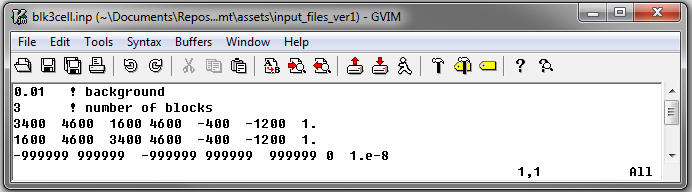
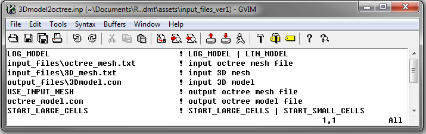
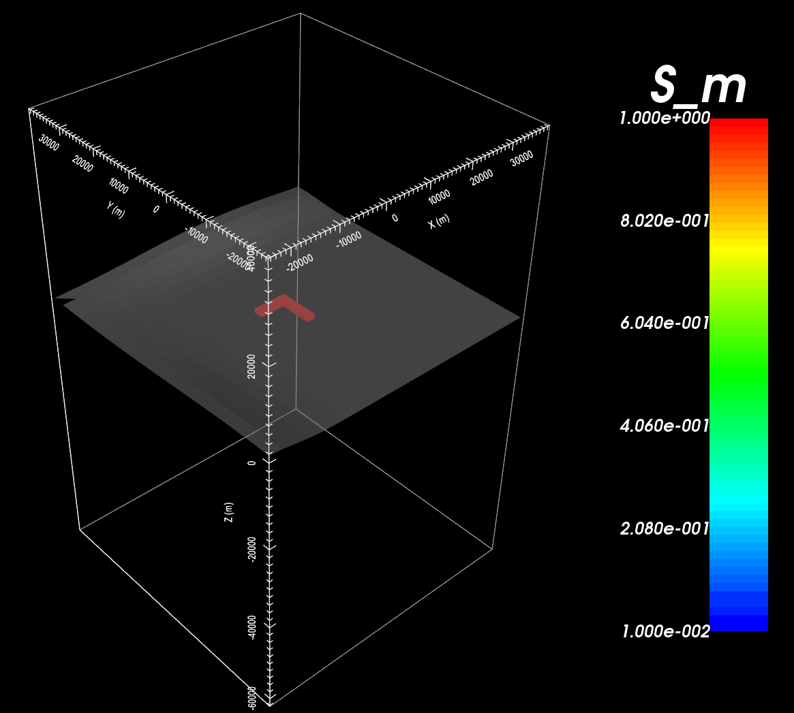

.. _example_model:

Create Model
============

Version 1 (2014 and 2015)
-------------------------

Here, the code **blk3cell.exe** and the input file **blk3cell.inp** (:ref:`see format <e3dmt_blk3cell_input>`) are used to create a conductivity model on the underlying tensor mesh. Then, the code **3DModel2Octree.exe** and the input file **3Dmodel2octree.inp** (:ref:`see format <e3dmt_3Dmodel2octree_input>`) are used to interpolate the tensor mesh onto the OcTree mesh. For this example, we use the mesh that was created in the example ":ref:`create OcTree mesh<example_octree>`". Files relevant to this part of the example are in the sub-folder *octree_model*. Before running this example, you may want to do the following:

	- `Download and open the zip folder containing the entire E3DMT version 1 example <https://github.com/ubcgif/e3dmt/raw/master/assets/e3dmt_ver1_example.zip>`__ (if not done already)
	- Learn how to run :ref:`blk3cell<e3dmt_model_blk3cell>` and :ref:`3DModel2Octree<e3dmt_model_3DtoOctree>` from command line
	- Learn the format of the input files :ref:`blk3cell.inp<e3dmt_blk3cell_input>` and :ref:`3Dmodel2octree.inp<e3dmt_3Dmodel2octree_input>`

Here is the input file for **blk3cell.exe**

.. warning:: It is not advisable to image models on the base tensor mesh as they can be prohibitively large (>> 1M cells).

Here is the input file for **3DModel2Octree.exe**

The resulting Octree model shows an L-shaped conductor (:math:`\sigma` = 1 S/m) within a resistive background (:math:`\sigma_b` = 0.01 S/m).

.. _example_model2:

Version 2 (2017)
----------------

.. raw:: html
    :file: ../../underconstruction.html