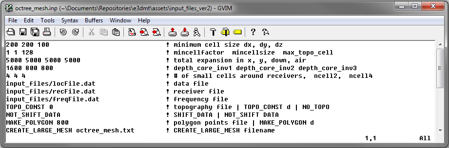
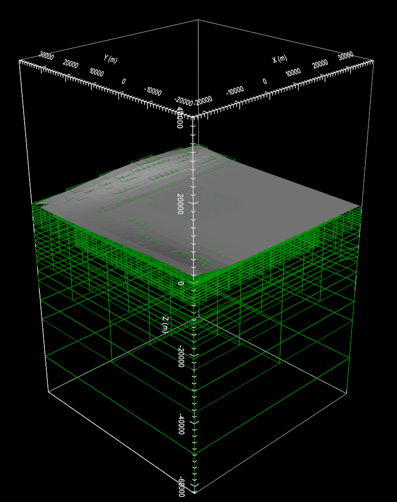

.. _example_octree:

Create OcTree Mesh
==================

Here, the code **octree_mesh_mt.exe** and the input file **MTcreate_mesh.inp** (ref:`see format<e3dmt_input_octree>`)are used to create an OcTree mesh based on the set of observation location and surface topography. Files relevant to this part of the example are in the sub-folder octree_mesh. Before running this example, you may want to do the following:

	- `Download and open the zip folder containing the entire E3DMT version 2 example <https://github.com/ubcgif/e3dmt/raw/manual_ver2/assets/e3dmt_ver2_example.zip>`__ (if not done already)
	- Learn how to :ref:`run code from command line<e3dmt_octree>`
	- Learn the :ref:`format of the input file<e3dmt_input_octree>`

To generate the OcTree mesh, the following input file was used:

The surface topography and resulting OcTree mesh are shown below

