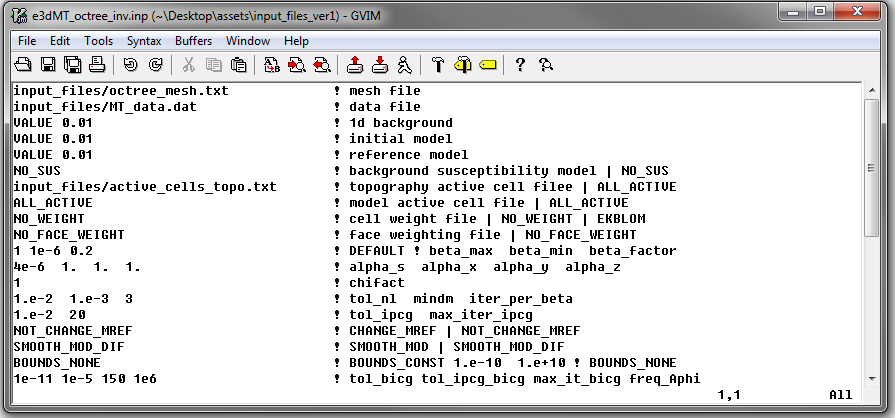

.. _example_inv:

Inversion
=========

Version 1 (2014 and 2015)
-------------------------

Here, the code **e3dMTinv_iter.exe** and the input file **e3dMT_octree_inv.inp** (:ref:`see format <e3dmt_input_inv>`) are used to invert MT data. MT data were created in the example ":ref:`forward modeling<example_fwd>`" and floor uncertainties of 0.0001 V/A were added to all impedance tensor elements. Files relevant to this part of the example are in the sub-folder *fwd*. Before running this example, you may want to do the following:

	- `Download and open the zip folder containing the entire E3DMT version 1 example <https://github.com/ubcgif/e3dmt/raw/master/assets/e3dmt_ver1_example.zip>`__ (if not done already)
	- :ref:`Learn how to run code from command line <e3dmt_inv>`
	- :ref:`Learn the format of the input file <e3dmt_input_inv>`

To forward model the data, the following input file was used:

Predicted data are shown below:

Version 2 (2017)
----------------
