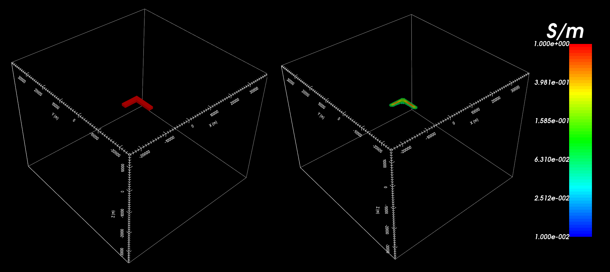

.. _example_inv:

Inversion
=========

Here, the code **e3dMTinv_iter.exe** and the input file **e3dMT_octree_inv.inp** (:ref:`see format <e3dmt_input_inv>`) are used to invert MT data. MT data were created in the example ":ref:`forward modeling<example_fwd>`" and simple floor uncertainties of 0.005 V/A were added to all impedance tensor elements. In practice, data are noisy and choosing appropriate uncertainties is very important for successful inversion. Files relevant to this part of the example are in the sub-folder *inv*. Before running this example, you may want to do the following:

	- `Download and open the zip folder containing the entire E3DMT version 1 example <https://github.com/ubcgif/e3dmt/raw/master/assets/e3dmt_ver1_example.zip>`__ (if not done already)
	- :ref:`Learn how to run code from command line <e3dmt_inv>`
	- :ref:`Learn the format of the input file <e3dmt_input_inv>`

To invert the synthetic data, the input file below was used:

.. figure:: ../inputfiles/images/create_inv_input.png
     :align: center
     :width: 700

The true model (left) and recovered model (right) at iteration 5 are shown below. A cutoff of 0.05 S/m has been used for both models and the recovered model is transected at z = -1200 m. 

