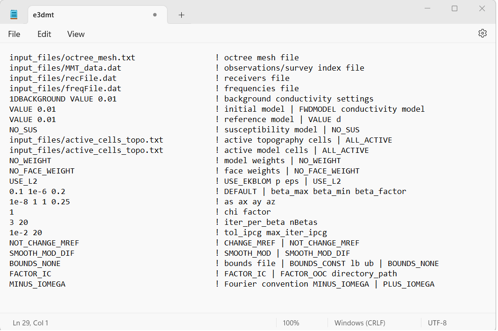
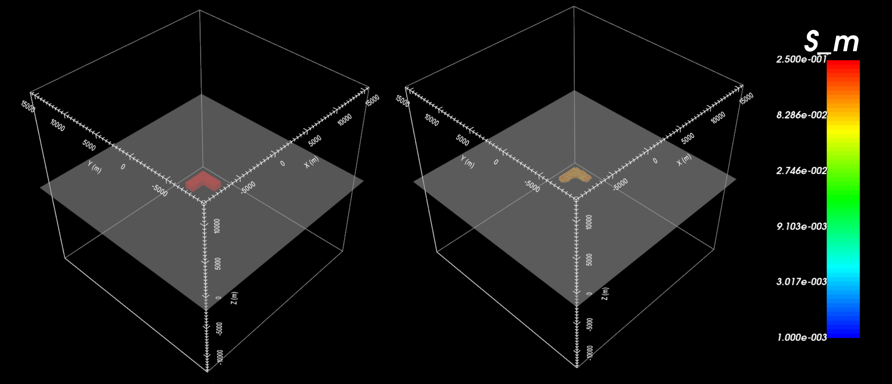

.. _exampleMMT_inv:

Inversion
=========

Here, the code **e3dmt_v2.exe** and the input file **e3dmt.inp** (:ref:`see format<e3dmt_input_inv>`) are used to invert MobileMT data. MobileMT data were created in the example :ref:`forward modeling<exampleMMT_fwd>`. 0.5\% noise were added to the apparent conductivity data prior to inversion. And uncertainties of 0.5\% were assigned to all data. In practice, we do not know the noise on our data, and choosing appropriate uncertainties to estimate the standard deviation of the noise is very important for successful inversion. Files relevant to this part of the example are in the sub-folder *inv*. Before running this example, you may want to do the following:

	- `Download and open the zip folder containing the entire E3DMT version 2 example <https://github.com/ubcgif/e3dmt/raw/e3dmt_v2/assets/e3dmt_v2_example_MMT.zip>`__ (if not done already)
	- Learn how to :ref:`run code from command line<e3dmt_inv>`
	- Learn the :ref:`format of the input file<e3dmt_input_inv>`

To invert the synthetic data, the following input file was used:

The true model (left) and recovered model (right) are shown below. A cutoff of 0.09 S/m has been used for both models.

