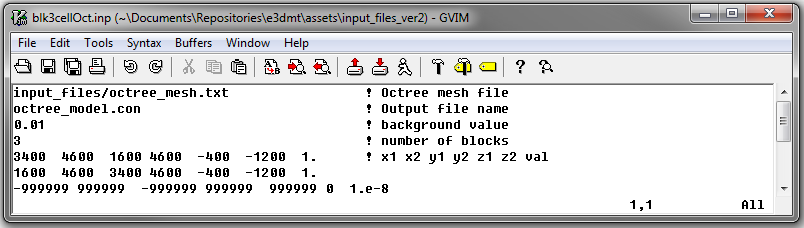
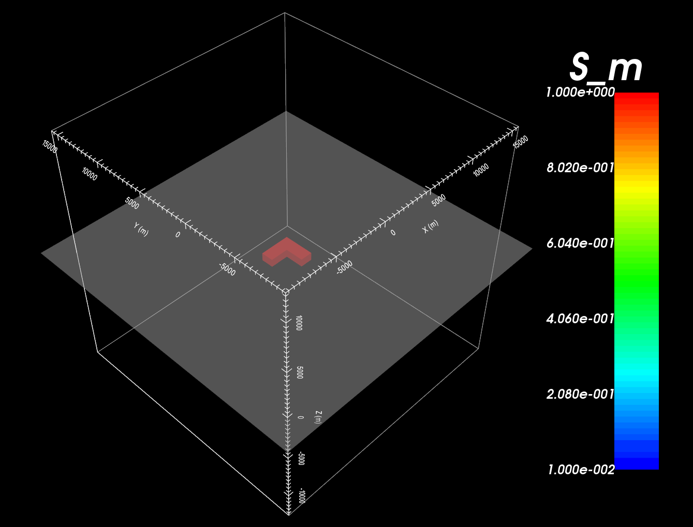

.. _example_model:

Create Model
============

Here, the code **blk3cellOct.exe** and the input file **blk3cellOct.inp** (:ref:`see format<e3dmt_input_model>`) are used to create a conductivity model on the OcTree mesh. For this example, we use the mesh that was created in the example “:ref:`create OcTree mesh<example_octree>`”. Files relevant to this part of the example are in the sub-folder *octree_model*. Before running this example, you may want to do the following:

	- `Download and open the zip folder containing the entire E3DMT version 2 example <https://github.com/ubcgif/e3dmt/raw/e3dmt_v2/assets/e3dmt_v2_example_MT.zip>`__ (if not done already)
	- Learn how to :ref:`run blk3cellOct from command line<e3dmt_model>`
	- Learn the format of the input files :ref:`blk3cellOct.inp<e3dmt_input_model>`

To generate the model, the following input file was used

The resulting Octree model shows an L-shaped conductor (:math:`\sigma` = 1 S/m) within a resistive background (:math:`\sigma_b` = 0.01 S/m).

