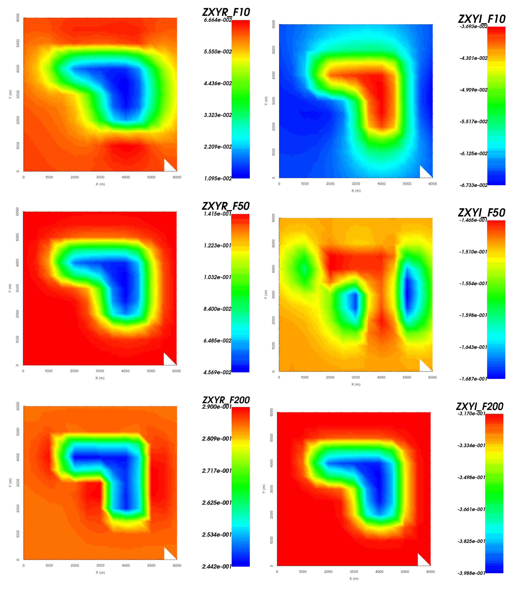

.. _example_fwd:

Forward Modeling
================

Here, the code **e3dmt_v2.exe** and the input file **e3dmtfwd.inp** (:ref:`see format<e3dmt_input_inv>`) are used to forward model MT data for a synthetic model. Files relevant to this part of the example are in the sub-folder *fwd*. For this example, we use the model that was created in the example :ref:`create model<example_model>`. Before running this example, you may want to do the following:

	- `Download and open the zip folder containing the entire E3DMT version 2 example <https://github.com/ubcgif/e3dmt/raw/e3dmt_v2/assets/e3dmt_v2_example_MT.zip>`__ (if not done already)
	- Learn how to :ref:`run code from command line<e3dmt_inv>`
	- Learn the format of the input file :ref:`in the case of forward modeling<e3dmt_input_inv>`

To forward model the data, the following input file was used:

Predicted data are shown below.

