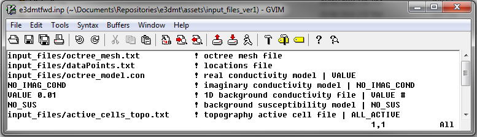

.. _exampleMT_fwd:

Forward Modeling
================

Here, the code **e3dmt_fwd.exe** and the input file **e3dmtfwd.inp** (:ref:`see format <e3dmt_input_fwd>`) are used to forward model MT data for a synthetic model. Files relevant to this part of the example are in the sub-folder *fwd*. For this example, we use the model that was created in the example ":ref:`create model<exampleMT_model>`". Before running this example, you may want to do the following:

	- `Download and open the zip folder containing the entire E3DMT version 1 example <https://github.com/ubcgif/e3dmt/raw/e3dmt/assets/e3dmt_v1_example_MT.zip>`__ (if not done already)
	- :ref:`Learn how to run code from command line <e3dmt_fwd>`
	- :ref:`Learn the format of the input file <e3dmt_input_fwd>`

To forward model the data, the following input file was used:

Predicted data are shown below.

