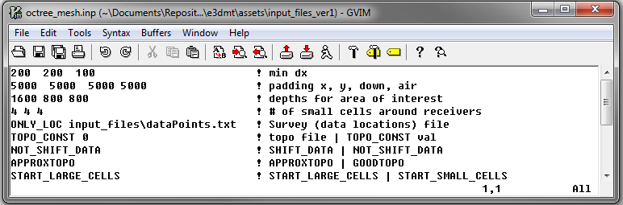
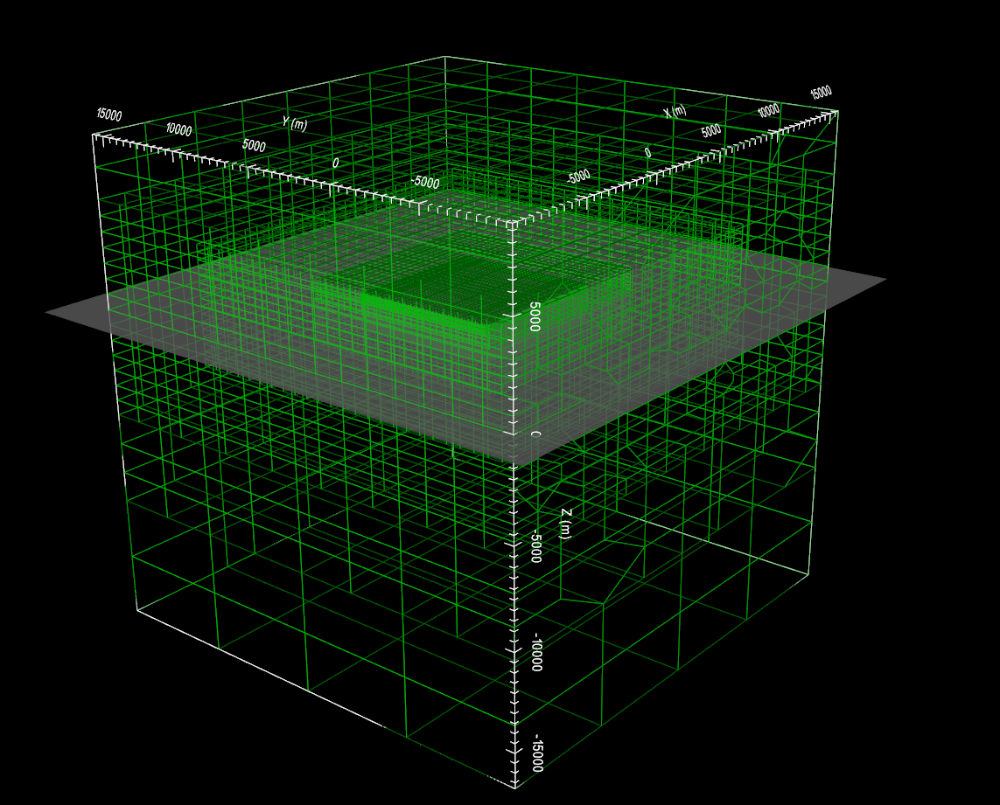

.. _exampleZTEM_octree:

Create OcTree Mesh
==================

Here, the code **create_octree_mesh_e3dmt.exe** and the input file **octree_mesh.inp** (:ref:`see format <e3dmt_input_octree>`) are used to create an OcTree mesh based on the set of observation location and surface topography. In our case, we set the topography to have a constant elevation of 0 m. Files relevant to this part of the example are in the sub-folder *octree_mesh*. Before running this example, you may want to do the following:

	- `Download and open the zip folder containing the entire E3DMT version 1 example <https://github.com/ubcgif/e3dmt/raw/e3dmt/assets/e3dmt_v1_example_ZTEM.zip>`__ (if not done already)
	- :ref:`Learn how to run code from command line <e3dmt_octree>`
	- :ref:`Learn the format of the input file <e3dmt_input_octree>`

To generate the OcTree mesh, the following input file was used:

The resulting OcTree mesh and surface topography are shown below.

