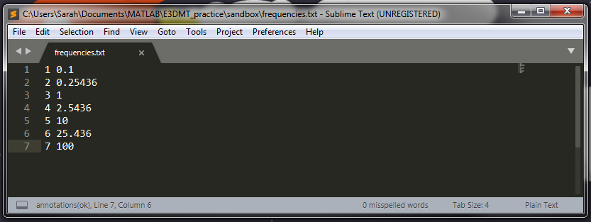

.. _freqFile:

Frequencies File
================

The format of the frequencies file is as follows:

|
| :math:`k_1 \;\;\;\;\; f_1`
| :math:`k_2 \;\;\;\;\; f_2`
| :math:`k_3 \;\;\;\;\; f_3`
| :math:`k_4 \;\;\;\;\; f_4`
| :math:`k_4 \;\;\;\;\; f_5`
| :math:`k_5 \;\;\;\;\; f_6`
| :math:`\;\;\;\;\;\;\vdots`
| :math:`k_{N-1} \; f_{N-1}`
| :math:`k_N \;\;\;\; f_N`
|
|

where 

    - :math:`N` is the number of unique frequencies within the file
    - :math:`k_i` defines the index value (1,2,....,N) for a particular frequency. Should be ordered 1 to N.
    - :math:`f_i` is the frequency in Hz.

Below we see an example of a frequencies file which defines 7 unique frequencies.

