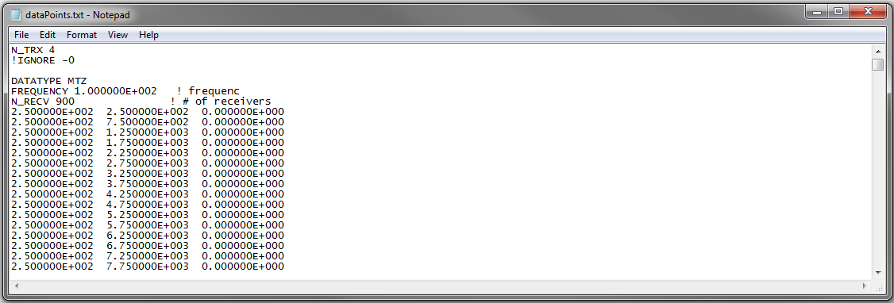
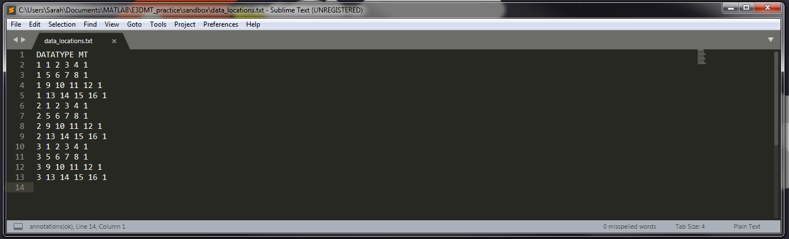
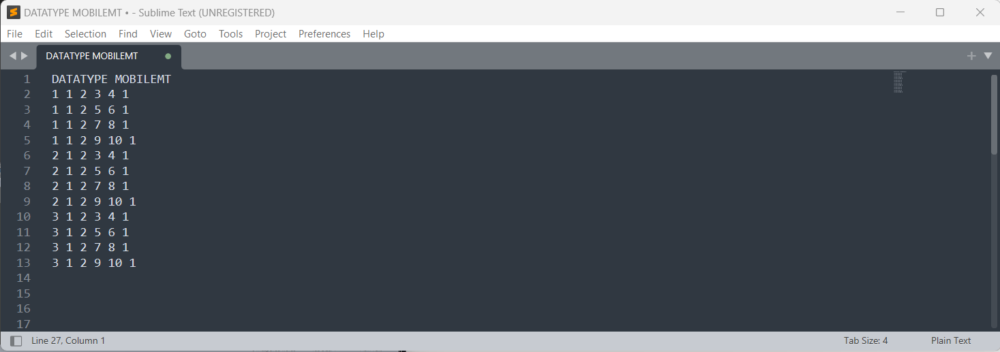
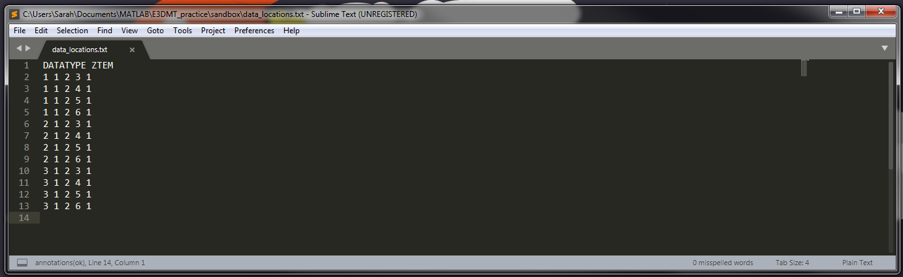

.. _indexFile:

Survey File
===========

.. important:: E3DMT version 2 is able to predict synthetic field data (forward modeling) with survey files that follow the :ref:`E3DMT version 1<indexFile1>` format as well as a newly developed :ref:`version 2 format<indexFile2>`.

.. _indexFile1:

Version 1
---------

E3DMT version 2 is capable of predicting synthetic field data (forward modeling) with the survey file format used by E3DMT version 1. This file contains all necessary survey information including: the number of transmitters (groups of natural source data), data types, measurement frequencies and receiver locations. 

The lines of a locations file with one or more transmitters is formatted as follows:

.. note::
    - Bolded entries are fixed flags recognized by the Fortran codes and blue hyperlinked entries are values/regular expressions specified by the user
    - Each unique data type, frequency and set of observation locations corresponds to a unique "transmitter"; e.g. 2 transmitters must be specified if the same data are collected at the same locations at 2 different frequencies.
    - Each block containing DATATYPE, FREQUENCY, N_RECV and the data array

|
| **N_TRX** :math:`\;` :ref:`A<e3dmt_survey_ln1>`
|
| **DATATYPE** :math:`\;` :ref:`B<e3dmt_survey_ln3>`
| **FREQUENCY** :math:`\;` :ref:`C<e3dmt_survey_ln4>`
| **N_RECV** :math:`\;` :ref:`D<e3dmt_survey_ln5>`
| :ref:`Data Array<e3dmt_survey_ln6>`
|
| **DATATYPE** :math:`\;` :ref:`B<e3dmt_survey_ln3>`
| **FREQUENCY** :math:`\;` :ref:`C<e3dmt_survey_ln4>`
| **N_RECV** :math:`\;` :ref:`D<e3dmt_survey_ln5>`
| :ref:`Data Array<e3dmt_survey_ln6>`
|
| :math:`\;\;\;\;\;\;\;\; \vdots`
|
| **DATATYPE** :math:`\;` :ref:`B<e3dmt_survey_ln3>`
| **FREQUENCY** :math:`\;` :ref:`C<e3dmt_survey_ln4>`
| **N_RECV** :math:`\;` :ref:`D<e3dmt_survey_ln5>`
| :ref:`Data Array<e3dmt_survey_ln6>`
|
|

     Example locations file for MTZ data.

Parameter Descriptions
^^^^^^^^^^^^^^^^^^^^^^

.. _e3dmt_survey_ln1:

    - **(A) Number of transmitters:** In line 1, the number of transmitters/groups of natural source EM data is specified. Example: *N_TRX 3*

.. _e3dmt_survey_ln3:

    - **(B) Data type:**. For the data corresponding to each transmitter, this line sets the type of data. Example: *DATATYPE MTZ*. There are 4 options for DATATYPE:

        - "MTZ" - MT data (Both real and imaginary impedance tensor data)
        - "MTT" - ZTEM data (Hx and Hy constant at first receiver location and first receiver station defines base station)
        - "MTE" - ZTEM data where Hx, Hy are calculated at the base station from the initial model
        - "MTH" - ZTEM data (reference is at the data points - no base station)

.. important::
    
    - Data type MTE cannot be used in forward modeling, as there is no initial model initial model in this case.
    - When modeling MT and ZTEM data simultaneously, you must choose either type MTZ and MTT OR MTZ and MTH; e.g. you cannot have MTT and MTH in the same locations file.
        
.. _e3dmt_survey_ln4:

    - **(C) Frequency:** Frequency at which the corresponding set of field observations are made. Example: *FREQUENCY 1.0000E+002*.

.. _e3dmt_survey_ln5:

    - **(D) Number of receivers:** Number of receivers collecting data at the aforementioned frequency for the aforementioned data type. Example: *N_RECV 900*.

.. _e3dmt_survey_ln6:

    - **Data Array:** Contains the locations and field observations for the data specified by :ref:`data type<e3dmt_survey_ln3>`. The number of lines in this array is equal to the number of receivers. The number of columns depends on the type of data specified. The columns for defined for each array are show :ref:`below<surveyFile_data>`.

.. _surveyFile_data:

Data Array
^^^^^^^^^^

**MT data (DATATYPE = MTZ or MTE) or ZTEM data:**

No matter what data type is being used (DATATYPE = MTZ, MTE, MTT or MTH), each row of the data array contains the x, y and z positions for readings at a particular location, i.e.:

.. math::
    | \; Easting \; | \; Northing \; | \; Elevation \; |

.. important::

    - The locations are Easting, Northing and elevation in metres.
    - If MT and/or ZTEM data are being modeled, the frequencies do not need to match nor do the locations for each frequency.
    - For **MTT data (ZTEM)**, the first line in the array refers to the base/reference station location. Thus if there are :math:`N` receiver locations specified for a given array with data type "MTT", the forward model will output :math:`N-1` rows of predicted data.
    - For **MTH data (ZTEM)**, measurements Hx, Hy and Hz are taken at the same location. Thus if there are :math:`N` receiver locations specified for a given array with data type "MTH", the forward model will output :math:`N` rows of predicted data.

.. _indexFile2:

Version 2
---------

This file is used to define the locations and frequencies in which MT and/or ZTEM data are predicted using the E3DMT version 2 data format. Each row of the survey file is used to index the electric dipole and/or inductive loop receivers corresponding to a specific set of impedance tensor or Z-axis tipper measurements. The indicies correspond to receivers defined within the :ref:`receiver file<receiverFile>` and frequencies defined within the :ref:`frequencies file<freqFile>` . The user also defines the data type being modeled.

Format
^^^^^^

The lines of a survey file with one or more blocks of natural source data are defined as follows:

.. note::
    - Recall that we are using a labeling convention for fields such that X = Northing, Y = Easting and Z = Down.
    - Bolded entries are fixed flags recognized by the Fortran codes and blue hyperlinked entries are values/regular expressions specified by the user

|
| **DATATYPE** :ref:`dflag<indexFile2_dflag>`
| *Data Array 1*
|
| **DATATYPE** :ref:`dflag<indexFile2_dflag>`
| *Data Array 2*
|
| :math:`\;\;\;\;\;\;\;\; \vdots`
|
| **DATATYPE** :ref:`dflag<indexFile2_dflag>`
| *Data Array N*
|
|
|

.. _indexFile2_dflag:

    - **dflag:** Specifies whether the following data array is MT, expert geophysics mobile MT, or ZTEM data. To specify for each block, use the flag *MT*, *MOBILEMT* or *ZTEM*. Multiple MT, MOBILEMT and/or ZTEM data blocks can be used.

MT Data Array
~~~~~~~~~~~~~

The indicies used to define MT data arrays are as follows:

|
|
| :ref:`f_ind<e3dmt_ind_ln1>` :math:`\;` :ref:`Ey_ind<e3dmt_ind_ln2>` :math:`\;` :ref:`Ex_ind<e3dmt_ind_ln3>` :math:`\;` :ref:`Hy_ind<e3dmt_ind_ln4>` :math:`\;` :ref:`Hx_ind<e3dmt_ind_ln5>` :math:`\;` :ref:`1<e3dmt_ind_ln7>`
| :ref:`f_ind<e3dmt_ind_ln1>` :math:`\;` :ref:`Ey_ind<e3dmt_ind_ln2>` :math:`\;` :ref:`Ex_ind<e3dmt_ind_ln3>` :math:`\;` :ref:`Hy_ind<e3dmt_ind_ln4>` :math:`\;` :ref:`Hx_ind<e3dmt_ind_ln5>` :math:`\;` :ref:`1<e3dmt_ind_ln7>`
| :ref:`f_ind<e3dmt_ind_ln1>` :math:`\;` :ref:`Ey_ind<e3dmt_ind_ln2>` :math:`\;` :ref:`Ex_ind<e3dmt_ind_ln3>` :math:`\;` :ref:`Hy_ind<e3dmt_ind_ln4>` :math:`\;` :ref:`Hx_ind<e3dmt_ind_ln5>` :math:`\;` :ref:`1<e3dmt_ind_ln7>`
| :math:`\;\;\;\;\;\;\;\;\;\;\;\;\;\;\;\;\;\;\;\;\;\;\;\;\;\;\;\;\;\;\;\;\; \vdots`
| :ref:`f_ind<e3dmt_ind_ln1>` :math:`\;` :ref:`Ey_ind<e3dmt_ind_ln2>` :math:`\;` :ref:`Ex_ind<e3dmt_ind_ln3>` :math:`\;` :ref:`Hy_ind<e3dmt_ind_ln4>` :math:`\;` :ref:`Hx_ind<e3dmt_ind_ln5>` :math:`\;` :ref:`1<e3dmt_ind_ln7>`
|
|

Below we show an example of a survey file for MT data. In this case, the impedance tensor data are modeled at 3 frequencies and a new set of receivers is used at each measurement site.

     survey file for MT data.

.. important::

    - The frequency indicies in row 1 cannot decrease in value; e.g. you cannot have a row which starts with 3 followed by a row that starts with 2.
    - The number of rows and receiver indicies for measurements at a given frequency do not need to match those for another frequency; e.g. you can have 50 stations taking measurements at 1 Hz and 65 completely different stations taking measurements at 10 Hz.

Expert Geophysics MT Data Array
~~~~~~~~~~~~~~~~~~~~~~~~~~~~~~~

The indicies used to define Expert Geophysics mobile MT data arrays are as follows:

|
|
| :ref:`f_ind<e3dmt_ind_ln1>` :math:`\;` :ref:`Ey_ind<e3dmt_ind_ln2>` :math:`\;` :ref:`Ex_ind<e3dmt_ind_ln3>` :math:`\;` :ref:`Hy_ind<e3dmt_ind_ln4>` :math:`\;` :ref:`Hx_ind<e3dmt_ind_ln5>` :math:`\;` :ref:`1<e3dmt_ind_ln7>`
| :ref:`f_ind<e3dmt_ind_ln1>` :math:`\;` :ref:`Ey_ind<e3dmt_ind_ln2>` :math:`\;` :ref:`Ex_ind<e3dmt_ind_ln3>` :math:`\;` :ref:`Hy_ind<e3dmt_ind_ln4>` :math:`\;` :ref:`Hx_ind<e3dmt_ind_ln5>` :math:`\;` :ref:`1<e3dmt_ind_ln7>`
| :ref:`f_ind<e3dmt_ind_ln1>` :math:`\;` :ref:`Ey_ind<e3dmt_ind_ln2>` :math:`\;` :ref:`Ex_ind<e3dmt_ind_ln3>` :math:`\;` :ref:`Hy_ind<e3dmt_ind_ln4>` :math:`\;` :ref:`Hx_ind<e3dmt_ind_ln5>` :math:`\;` :ref:`1<e3dmt_ind_ln7>`
| :math:`\;\;\;\;\;\;\;\;\;\;\;\;\;\;\;\;\;\;\;\;\;\;\;\;\;\;\;\;\;\;\;\;\; \vdots`
| :ref:`f_ind<e3dmt_ind_ln1>` :math:`\;` :ref:`Ey_ind<e3dmt_ind_ln2>` :math:`\;` :ref:`Ex_ind<e3dmt_ind_ln3>` :math:`\;` :ref:`Hy_ind<e3dmt_ind_ln4>` :math:`\;` :ref:`Hx_ind<e3dmt_ind_ln5>` :math:`\;` :ref:`1<e3dmt_ind_ln7>`
|
|

Below we show an example of a survey file for MT data. In this case, the apparent conductivity data are modeled at 3 frequencies. Receivers 1 and 2 are the e-field receivers at the base
station used for all data locations each measurement site.

     survey file for mobile MT data.

.. important::

    - The frequency indicies in row 1 cannot decrease in value; e.g. you cannot have a row which starts with 3 followed by a row that starts with 2.
    - The number of rows and receiver indicies for measurements at a given frequency do not need to match those for another frequency; e.g. you can have 50 stations taking measurements at 1 Hz and 65 completely different stations taking measurements at 10 Hz.

ZTEM Data Array
~~~~~~~~~~~~~~~

The indicies used to define ZTEM data arrays are as follows:

|
|
| :ref:`f_ind<e3dmt_ind_ln1>` :math:`\;` :ref:`Hy_ind<e3dmt_ind_ln4>` :math:`\;` :ref:`Hx_ind<e3dmt_ind_ln5>` :math:`\;` :ref:`Hz_ind<e3dmt_ind_ln6>` :math:`\;` :ref:`1<e3dmt_ind_ln7>`
| :ref:`f_ind<e3dmt_ind_ln1>` :math:`\;` :ref:`Hy_ind<e3dmt_ind_ln4>` :math:`\;` :ref:`Hx_ind<e3dmt_ind_ln5>` :math:`\;` :ref:`Hz_ind<e3dmt_ind_ln6>` :math:`\;` :ref:`1<e3dmt_ind_ln7>`
| :ref:`f_ind<e3dmt_ind_ln1>` :math:`\;` :ref:`Hy_ind<e3dmt_ind_ln4>` :math:`\;` :ref:`Hx_ind<e3dmt_ind_ln5>` :math:`\;` :ref:`Hz_ind<e3dmt_ind_ln6>` :math:`\;` :ref:`1<e3dmt_ind_ln7>`
| :math:`\;\;\;\;\;\;\;\;\;\;\;\;\;\;\;\;\;\;\;\;\;\;\;\;\; \vdots`
| :ref:`f_ind<e3dmt_ind_ln1>` :math:`\;` :ref:`Hy_ind<e3dmt_ind_ln4>` :math:`\;` :ref:`Hx_ind<e3dmt_ind_ln5>` :math:`\;` :ref:`Hz_ind<e3dmt_ind_ln6>` :math:`\;` :ref:`1<e3dmt_ind_ln7>`
|
|

Below we show an example of a survey file for ZTEM data. In this case, the tipper data are modeled at 3 frequencies and the same receiver is used to measure Hx and Hy at all measurement sites.

     survey file for ZTEM data.

.. important::

    - The frequency indicies in row 1 cannot decrease in value; e.g. you cannot have a row which starts with 3 followed by a row that starts with 2.
    - The number of rows and receiver indicies for measurements at a given frequency do not need to match those for another frequency; e.g. you can have 50 stations taking measurements at 1 Hz and 65 completely different stations taking measurements at 10 Hz.

Parameter Descriptions
^^^^^^^^^^^^^^^^^^^^^^

.. _e3dmt_ind_ln1:

    - **f_ind:** The index corresponding to the desired frequency within the :ref:`frequencies file<freqFile>`. 

.. _e3dmt_ind_ln2:

    - **Ex_ind:** The index corresponding to the desired receiver within the :ref:`receiver file<receiverFile>` that measures the X (Northing) component of the electric field (Ex).

.. _e3dmt_ind_ln3:

    - **Ey_ind:** The index corresponding to the desired receiver within the :ref:`receiver file<receiverFile>` that measures the Y (Easting) component of the electric field (Ey).

.. _e3dmt_ind_ln4:

    - **Hx_ind:** The index corresponding to the desired receiver within the :ref:`receiver file<receiverFile>` that measures the X (Northing) component of the magnetic field (Hx).

.. _e3dmt_ind_ln5:

    - **Hy_ind:** The index corresponding to the desired receiver within the :ref:`receiver file<receiverFile>` that measures the Y (Easting) component of the magnetic field (Hy).

.. _e3dmt_ind_ln6:

    - **Hz_ind:** The index corresponding to the desired receiver within the :ref:`receiver file<receiverFile>` that measures the Z (Downward) component of the magnetic field (Hz).

.. _e3dmt_ind_ln7:

    - **1:** As of May 2018, a flag value of 1 is entered here. In future iterations of the code, this entry may be related to additional functionality.

