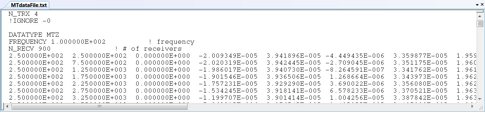

.. _obsFile:

Observations File
=================

.. important:: E3DMT version 2 is able to invert field data from survey files that follow the :ref:`E3DMT version 1<obsFile1>` format as well as a newly developed :ref:`version 2 format<obsFile2>`.

.. _obsFile1:

Version 1
---------

The E3DMT version 1 observations file contains the survey information, field observations and data uncertainties. 

Format
^^^^^^

.. note::
    - Bolded entries are fixed flags recognized by the Fortran codes and blue hyperlinked entries are values/regular expressions specified by the user
    - Each unique data type, frequency and set of observation locations corresponds to a unique "transmitter"; e.g. 2 transmitters must be specified if the same data are collected at the same locations at 2 different frequencies.
    - Each block contains DATATYPE, FREQUENCY, N_RECV and the data array

The lines of a data file with one or more transmitters are formatted as follows:

| **N_TRX** :math:`\;` :ref:`A<e3dmt_obs_ln1>`
| **!IGNORE** :math:`\;` :ref:`B<e3dmt_obs_ln2>`
|
| **DATATYPE** :math:`\;` :ref:`C<e3dmt_obs_ln3>`
| **FREQUENCY** :math:`\;` :ref:`D<e3dmt_obs_ln4>`
| **N_RECV** :math:`\;` :ref:`E<e3dmt_obs_ln5>`
| :ref:`Data Array<e3dmt_obs_ln6>`
|
| **DATATYPE** :math:`\;` :ref:`C<e3dmt_obs_ln3>`
| **FREQUENCY** :math:`\;` :ref:`D<e3dmt_obs_ln4>`
| **N_RECV** :math:`\;` :ref:`E<e3dmt_obs_ln5>`
| :ref:`Data Array<e3dmt_obs_ln6>`
|
| :math:`\;\;\;\;\;\;\;\; \vdots`
|
| **DATATYPE** :math:`\;` :ref:`C<e3dmt_obs_ln3>`
| **FREQUENCY** :math:`\;` :ref:`D<e3dmt_obs_ln4>`
| **N_RECV** :math:`\;` :ref:`E<e3dmt_obs_ln5>`
| :ref:`Data Array<e3dmt_obs_ln6>`
|
|

     Example data file for MTZ data.

Parameter Descriptions
^^^^^^^^^^^^^^^^^^^^^^

.. _e3dmt_obs_ln1:

    - **(A) Number of transmitters:** In line 1, the number of transmitters/groups of natural source EM data is specified. Example: *N_TRX 3*

.. _e3dmt_obs_ln2:

    - **(B) Flag to ignore data entries:** A regular expression is entered, signifying data in the data structure which is ignored during the inversion. Example: *!IGNORE -0*. Therefore we do no need to invert all components of the impedance tensor or transfer function.

.. _e3dmt_obs_ln3:

    - **(C) Data type:**. For the data corresponding to each transmitter, this line sets the type of data. Example: *DATATYPE MTZ*. There are 4 options for DATATYPE:

        - "MTZ" - MT data (Both real and imaginary impedance tensor data)
        - "MTT" - ZTEM data (Hx and Hy constant at first receiver location and first receiver station defines base station)
        - "MTE" - ZTEM data where Hx, Hy are calculated at the base station from the initial model
        - "MTH" - ZTEM data (reference is at the data points - no base station)

.. important::

    - When modeling MT and ZTEM data simultaneously, you must choose either type MTZ and MTT or MT and MTE or MTZ and MTH; e.g. you cannot have MTT, MTE and MTH in the same observations file.
        
.. _e3dmt_obs_ln4:

    - **(D) Frequency:** Frequency at which the corresponding set of field observations are made. Example: *FREQUENCY 1.0000E+002*.

.. _e3dmt_obs_ln5:

    - **(E) Number of receivers:** Number of receivers collecting data at the aforementioned frequency for the aforementioned data type. Example: *N_RECV 900*.

.. _e3dmt_obs_ln6:

    - **Data Array:** Contains the locations and field observations for the data specified by :ref:`data type<e3dmt_obs_ln3>`. The number of lines in this array is equal to the number of receivers. The number of columns depends on the type of data specified. The columns for defined for each array are show :ref:`below<obsFile_data>`.

.. _obsFile_data:

Data Arrays by Type
^^^^^^^^^^^^^^^^^^^

**MT data (DATATYPE = MTZ):**

Each row in the array contains the elements of the impedance tensor at a particular location separated into real and imaginary components, along with the corresponding uncertainties. The units for MT data are (V/A). The columns for this data format are as follows:

.. math::
    | \; Easting \; | \; Northing \; | \; Elevation \; | \;\;\; Z_{xx} \; data \;\;\; | \;\;\; Z_{xy} \; data \;\;\; | \;\;\; Z_{yx} \; data \;\;\; | \;\;\; Z_{yy} \; data \;\;\; |

such that each :math:`Z_{ij} \; data` is comprised of 4 columns:

.. math::

    | \; Z^\prime_{ij} \; | \; U^\prime_{ij} \; | \; Z^{\prime \prime}_{ij} \; | \; U^{\prime \prime}_{ij} \; |

where

    - :math:`Z^\prime_{ij}` is the real component of entry i,j of the impedance tensor
    - :math:`Z^{\prime\prime}_{ij}` is the imaginary component of entry i,j of the impedance tensor
    - :math:`U^\prime_{ij}` is the uncertainty on :math:`Z^\prime_{ij}`
    - :math:`U^{\prime\prime}_{ij}` is the uncertainty on :math:`Z^{\prime\prime}_{ij}`

.. important:: For standard MT data, X = Northing, Y = Easting and Z = Down; which this code uses! Thus :math:`Z_{xy}` is essentially the ratio of the electric field along the Northing and the magnetic field along the Easting. For more, see the :ref:`theory section <theory_nsem>`.

**ZTEM data (DATATYPE = MTT, MTE or MTH):**

Each row in the array contains the elements of the transfer function at a particular location separated into real and imaginary components, along with the corresponding uncertainties. Data values and uncertainties are unitless with no normalization factor. The columns for this data format are as follows:

.. math::
    | \; Easting \; | \; Northing \; | \; Elevation \; | \;\;\; T_{zx} \; data \;\;\; | \;\;\; T_{zy} \; data \;\;\; |

such that each :math:`T_{zx} \; data` is comprised of 4 columns:

.. math::

    | \; T^\prime_{zx} \; | \; U^\prime_{zx} \; | \; T^{\prime \prime}_{zx} \; | \; U^{\prime \prime}_{zx} \; |

where

    - :math:`T^\prime_{zx}` is the real component of :math:`T_{zx}`
    - :math:`T^{\prime\prime}_{zx}` is the imaginary component of :math:`T_{zx}`
    - :math:`U^\prime_{zx}` is the uncertainty on :math:`T^\prime_{zx}`
    - :math:`U^{\prime\prime}_{zx}` is the uncertainty on :math:`T^{\prime\prime}_{zx}`

and similarly for :math:`y`.

.. important:: For standard natural source data, X = Northing, Y = Easting and Z = Down; which this code uses! Thus :math:`T_{zx}` is the transfer function related to an incident plane wave whose electric field is polarized along the Northing direction; which produces magnetic fields with components in the Easting direction. For more, see the :ref:`theory section <theory_nsem>`.

.. important::

    - If MT and/or ZTEM data are being modeled, the frequencies do not need to match nor do the locations for each frequency.
    - For **MTT and MTE data (ZTEM)**, the first line in the array refers to the base/reference station location. Only the Easting, Northing and elevation is required. **However**, each remaining field must be given a flag value of "i". *Example for first row:* :math:`350 \;\; 200 \;\; 0 \;\; i \;\; i \;\; i \;\; i \;\; i \;\; i \;\; i \;\; i`
    - For **MTH data (ZTEM)**, measurements Hx, Hy and Hz are taken at different locations. Data and uncertainty values are required for all rows.
    - For **MTT and MTE data (ZTEM)**, the first line in the array refers to the base/reference station location. Thus if there are :math:`N` receiver locations specified for a given array with data type "MTT", the inversion will output :math:`N-1` rows of predicted data in the predicted data files.
    - For **MTH data (ZTEM)**, measurements Hx, Hy and Hz are taken at the same location. Thus if there are :math:`N` receiver locations specified for a given array with data type "MTH", the inversion model will output :math:`N` rows of predicted data in the predicted data files.

.. _obsFile2:

Version 2
---------

This file is input when inverting field-collected data. This file contains the survey information, field observations and data uncertainties. 

.. important::

    - Recall that we are using a labeling convention for fields such that X = Northing, Y = Easting and Z = Down.
    - If a flag value of '-99' is entered as an uncertainty, the corresponding data value is not fit during the inversion. Therefore, we can omit inverting the diagonal elements of the impedance tensor.

Format
^^^^^^

The lines of a data observations file are as follows:

| **DATATYPE** :ref:`dflag<e3dmt_obs2_dflag>`
| *Data Array 1*
|
| **DATATYPE** :ref:`dflag<e3dmt_obs2_dflag>`
| *Data Array 2*
|
| :math:`\;\;\;\;\;\;\;\; \vdots`
|
| **DATATYPE** :ref:`dflag<e3dmt_obs2_dflag>`
| *Data Array N*
|
|
|

.. _e3dmt_obs2_dflag:

    - **dflag:** Specifies whether the following data array is MT or ZTEM data. To specify for each block, use the flag *MT* or *ZTEM*. Multiple MT or ZTEM data blocks can be used. Therefore, joint inversion is possible with this code.

MT Data Array
~~~~~~~~~~~~~

The indicies used to define MT data arrays are as follows:

|
|
| :ref:`f_ind<e3dmt_obs2_ln1>` :math:`\;` :ref:`Ey_ind<e3dmt_obs2_ln2>` :math:`\;` :ref:`Ex_ind<e3dmt_obs2_ln3>` :math:`\;` :ref:`Hy_ind<e3dmt_obs2_ln4>` :math:`\;` :ref:`Hx_ind<e3dmt_obs2_ln5>` :math:`\;` :ref:`1<e3dmt_obs2_ln7>` :math:`\; [Z_{xx} \; data] \; [Z_{xy} \; data] \; [Z_{yx} \; data] \; [Z_{yy} \; data]`
| :ref:`f_ind<e3dmt_obs2_ln1>` :math:`\;` :ref:`Ey_ind<e3dmt_obs2_ln2>` :math:`\;` :ref:`Ex_ind<e3dmt_obs2_ln3>` :math:`\;` :ref:`Hy_ind<e3dmt_obs2_ln4>` :math:`\;` :ref:`Hx_ind<e3dmt_obs2_ln5>` :math:`\;` :ref:`1<e3dmt_obs2_ln7>` :math:`\; [Z_{xx} \; data] \; [Z_{xy} \; data] \; [Z_{yx} \; data] \; [Z_{yy} \; data]`
| :ref:`f_ind<e3dmt_obs2_ln1>` :math:`\;` :ref:`Ey_ind<e3dmt_obs2_ln2>` :math:`\;` :ref:`Ex_ind<e3dmt_obs2_ln3>` :math:`\;` :ref:`Hy_ind<e3dmt_obs2_ln4>` :math:`\;` :ref:`Hx_ind<e3dmt_obs2_ln5>` :math:`\;` :ref:`1<e3dmt_obs2_ln7>` :math:`\; [Z_{xx} \; data] \; [Z_{xy} \; data] \; [Z_{yx} \; data] \; [Z_{yy} \; data]`
| :math:`\;\;\;\;\;\;\;\;\;\;\;\;\;\;\;\;\;\;\;\;\;\;\;\;\;\;\;\;\;\;\;\;\;\;\;\;\;\;\;\;\;\;\;\;\;\;\;\;\;\;\;\;\;\;\;\;\;\; \vdots`
| :ref:`f_ind<e3dmt_obs2_ln1>` :math:`\;` :ref:`Ey_ind<e3dmt_obs2_ln2>` :math:`\;` :ref:`Ex_ind<e3dmt_obs2_ln3>` :math:`\;` :ref:`Hy_ind<e3dmt_obs2_ln4>` :math:`\;` :ref:`Hx_ind<e3dmt_obs2_ln5>` :math:`\;` :ref:`1<e3dmt_obs2_ln7>` :math:`\; [Z_{xx} \; data] \; [Z_{xy} \; data] \; [Z_{yx} \; data] \; [Z_{yy} \; data]`
|
|

such that each :math:`[Z_{ij} \; data]` is comprised of 4 columns:

.. math::

    | \; Z^\prime_{ij} \; | \; U^\prime_{ij} \; | \; Z^{\prime \prime}_{ij} \; | \; U^{\prime \prime}_{ij} \; |

where

    - :math:`Z^\prime_{ij}` is the real component of entry i,j of the impedance tensor
    - :math:`Z^{\prime\prime}_{ij}` is the imaginary component of entry i,j of the impedance tensor
    - :math:`U^\prime_{ij}` is the uncertainty on :math:`Z^\prime_{ij}`
    - :math:`U^{\prime\prime}_{ij}` is the uncertainty on :math:`Z^{\prime\prime}_{ij}`

.. important:: For standard MT data, X = Northing, Y = Easting and Z = Down; which this code uses! Thus :math:`Z_{xy}` is essentially the ratio of the electric field along the Northing and the magnetic field along the Easting. For more, see the :ref:`theory section<theory_nsem>`.

Below we show an example of a survey index file for MT data.

.. figure:: images/dobs2.png
     :align: center
     :width: 700

     Observed data file for MT data.

ZTEM Data Array
~~~~~~~~~~~~~~~

The indicies used to define ZTEM data arrays are as follows:

|
|
| :ref:`f_ind<e3dmt_obs2_ln1>` :math:`\;` :ref:`Hy_ind<e3dmt_obs2_ln4>` :math:`\;` :ref:`Hx_ind<e3dmt_obs2_ln5>` :math:`\;` :ref:`Hz_ind<e3dmt_obs2_ln6>` :math:`\;` :ref:`1<e3dmt_obs2_ln7>` :math:`\; [T_{zx} \; data] \; [T_{zy} \; data]`
| :ref:`f_ind<e3dmt_obs2_ln1>` :math:`\;` :ref:`Hy_ind<e3dmt_obs2_ln4>` :math:`\;` :ref:`Hx_ind<e3dmt_obs2_ln5>` :math:`\;` :ref:`Hz_ind<e3dmt_obs2_ln6>` :math:`\;` :ref:`1<e3dmt_obs2_ln7>` :math:`\; [T_{zx} \; data] \; [T_{zy} \; data]`
| :ref:`f_ind<e3dmt_obs2_ln1>` :math:`\;` :ref:`Hy_ind<e3dmt_obs2_ln4>` :math:`\;` :ref:`Hx_ind<e3dmt_obs2_ln5>` :math:`\;` :ref:`Hz_ind<e3dmt_obs2_ln6>` :math:`\;` :ref:`1<e3dmt_obs2_ln7>` :math:`\; [T_{zx} \; data] \; [T_{zy} \; data]`
| :math:`\;\;\;\;\;\;\;\;\;\;\;\;\;\;\;\;\;\;\;\;\;\;\;\;\;\;\;\;\;\;\;\;\;\;\;\;\; \vdots`
| :ref:`f_ind<e3dmt_obs2_ln1>` :math:`\;` :ref:`Hy_ind<e3dmt_obs2_ln4>` :math:`\;` :ref:`Hx_ind<e3dmt_obs2_ln5>` :math:`\;` :ref:`Hz_ind<e3dmt_obs2_ln6>` :math:`\;` :ref:`1<e3dmt_obs2_ln7>` :math:`\; [T_{zx} \; data] \; [T_{zy} \; data]`
|
|

such that each :math:`T_{zx} \; data` is comprised of 4 columns:

.. math::

    | \; T^\prime_{zx} \; | \; U^\prime_{zx} \; | \; T^{\prime \prime}_{zx} \; | \; U^{\prime \prime}_{zx} \; |

where

    - :math:`T^\prime_{zx}` is the real component of :math:`T_{zx}`
    - :math:`T^{\prime\prime}_{zx}` is the imaginary component of :math:`T_{zx}`
    - :math:`U^\prime_{zx}` is the uncertainty on :math:`T^\prime_{zx}`
    - :math:`U^{\prime\prime}_{zx}` is the uncertainty on :math:`T^{\prime\prime}_{zx}`

and similarly for :math:`T_{zy}`.

.. important:: For standard natural source data, X = Northing, Y = Easting and Z = Down; which this code uses! Thus :math:`T_{zx}` is the transfer function related to an incident plane wave whose electric field is polarized along the Northing direction; which produces magnetic fields with components in the Easting direction. For more, see the :ref:`theory section<theory_nsem>`.

Parameter Descriptions
^^^^^^^^^^^^^^^^^^^^^^

.. _e3dmt_obs2_ln1:

    - **f_ind:** The index corresponding to the desired frequency within the :ref:`frequencies file<freqFile>`. 

.. _e3dmt_obs2_ln2:

    - **Ex_ind:** The index corresponding to the desired receiver within the :ref:`receiver file<receiverFile>` that measures the X (Northing) component of the electric field (Ex).

.. _e3dmt_obs2_ln3:

    - **Ey_ind:** The index corresponding to the desired receiver within the :ref:`receiver file<receiverFile>` that measures the Y (Easting) component of the electric field (Ey).

.. _e3dmt_obs2_ln4:

    - **Hx_ind:** The index corresponding to the desired receiver within the :ref:`receiver file<receiverFile>` that measures the X (Northing) component of the magnetic field (Hx).

.. _e3dmt_obs2_ln5:

    - **Hy_ind:** The index corresponding to the desired receiver within the :ref:`receiver file<receiverFile>` that measures the Y (Easting) component of the magnetic field (Hy).

.. _e3dmt_obs2_ln6:

    - **Hz_ind:** The index corresponding to the desired receiver within the :ref:`receiver file<receiverFile>` that measures the Z (Downward) component of the magnetic field (Hz).

.. _e3dmt_obs2_ln7:

    - **1:** As of May 2018, a flag value of 1 is entered here. In future iterations of the code, this entry may be related to additional functionality.

