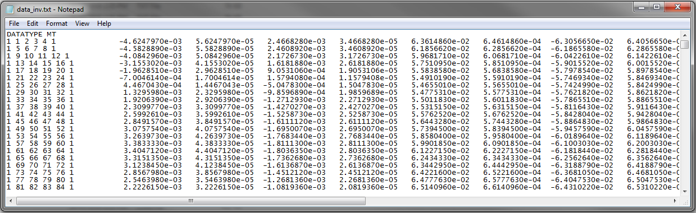

.. _obsFile:

Observations File
=================

.. _obsFile2:

This file is input when inverting field-collected data. This file contains the survey information, field observations and data uncertainties. 

.. important::

    - Recall that we are using a labeling convention for fields such that X = Northing, Y = Easting and Z = Down.
    - As of May 2018, the E3DMT version 2 code cannot simultaneously invert both MT and ZTEM data, just one or the other.
    - If a flag value of '-99' is entered as an uncertainty, the corresponding data value is not fit during the inversion. Therefore, we can omit inverting the diagonal elements of the impedance tensor.

MT Data Format
^^^^^^^^^^^^^^

.. note:: Blue hyperlinked entries are values/regular expressions specified by the user

The format of the observation file for MT data begins by defining the datatype flag on the first line. The frequency index, receiver indicies, observed data and uncertainties are then defined on each subsequent line.

| **DATATYPE MT**
| :ref:`f_ind<e3dmt_obs2_ln1>` :math:`\;` :ref:`Ey_ind<e3dmt_obs2_ln2>` :math:`\;` :ref:`Ex_ind<e3dmt_obs2_ln3>` :math:`\;` :ref:`Hy_ind<e3dmt_obs2_ln4>` :math:`\;` :ref:`Hx_ind<e3dmt_obs2_ln5>` :math:`\;` :ref:`1<e3dmt_obs2_ln7>` :math:`\; [Z_{xx} \; data] \; [Z_{xy} \; data] \; [Z_{yx} \; data] \; [Z_{yy} \; data]`
| :ref:`f_ind<e3dmt_obs2_ln1>` :math:`\;` :ref:`Ey_ind<e3dmt_obs2_ln2>` :math:`\;` :ref:`Ex_ind<e3dmt_obs2_ln3>` :math:`\;` :ref:`Hy_ind<e3dmt_obs2_ln4>` :math:`\;` :ref:`Hx_ind<e3dmt_obs2_ln5>` :math:`\;` :ref:`1<e3dmt_obs2_ln7>` :math:`\; [Z_{xx} \; data] \; [Z_{xy} \; data] \; [Z_{yx} \; data] \; [Z_{yy} \; data]`
| :ref:`f_ind<e3dmt_obs2_ln1>` :math:`\;` :ref:`Ey_ind<e3dmt_obs2_ln2>` :math:`\;` :ref:`Ex_ind<e3dmt_obs2_ln3>` :math:`\;` :ref:`Hy_ind<e3dmt_obs2_ln4>` :math:`\;` :ref:`Hx_ind<e3dmt_obs2_ln5>` :math:`\;` :ref:`1<e3dmt_obs2_ln7>` :math:`\; [Z_{xx} \; data] \; [Z_{xy} \; data] \; [Z_{yx} \; data] \; [Z_{yy} \; data]`
| :math:`\;\;\;\;\;\;\;\;\;\;\;\;\;\;\;\;\;\;\;\;\;\;\;\;\;\;\;\;\;\;\;\;\;\;\;\;\;\;\;\;\;\;\;\;\;\;\;\;\;\;\;\;\;\;\;\;\;\; \vdots`
| :ref:`f_ind<e3dmt_obs2_ln1>` :math:`\;` :ref:`Ey_ind<e3dmt_obs2_ln2>` :math:`\;` :ref:`Ex_ind<e3dmt_obs2_ln3>` :math:`\;` :ref:`Hy_ind<e3dmt_obs2_ln4>` :math:`\;` :ref:`Hx_ind<e3dmt_obs2_ln5>` :math:`\;` :ref:`1<e3dmt_obs2_ln7>` :math:`\; [Z_{xx} \; data] \; [Z_{xy} \; data] \; [Z_{yx} \; data] \; [Z_{yy} \; data]`
|
|

such that each :math:`[Z_{ij} \; data]` is comprised of 4 columns:

.. math::

    | \; Z^\prime_{ij} \; | \; U^\prime_{ij} \; | \; Z^{\prime \prime}_{ij} \; | \; U^{\prime \prime}_{ij} \; |

where

    - :math:`Z^\prime_{ij}` is the real component of entry i,j of the impedance tensor
    - :math:`Z^{\prime\prime}_{ij}` is the imaginary component of entry i,j of the impedance tensor
    - :math:`U^\prime_{ij}` is the uncertainty on :math:`Z^\prime_{ij}`
    - :math:`U^{\prime\prime}_{ij}` is the uncertainty on :math:`Z^{\prime\prime}_{ij}`

.. important:: For standard MT data, X = Northing, Y = Easting and Z = Down; which this code uses! Thus :math:`Z_{xy}` is essentially the ratio of the electric field along the Northing and the magnetic field along the Easting. For more, see the :ref:`theory section<theory_nsem>`.

Below we show an example of a survey index file for MT data.

     Observed data file for MT data.

ZTEM Data Format
^^^^^^^^^^^^^^^^

The format of the observation file for ZTEM data begins by defining the datatype flag on the first line. The frequency index, receiver indicies, observed data and uncertainties are then defined on each subsequent line.

| **DATATYPE ZTEM**
| :ref:`f_ind<e3dmt_obs2_ln1>` :math:`\;` :ref:`Hy_ind<e3dmt_obs2_ln4>` :math:`\;` :ref:`Hx_ind<e3dmt_obs2_ln5>` :math:`\;` :ref:`Hz_ind<e3dmt_obs2_ln6>` :math:`\;` :ref:`1<e3dmt_obs2_ln7>` :math:`\; [T_{zx} \; data] \; [T_{zy} \; data]`
| :ref:`f_ind<e3dmt_obs2_ln1>` :math:`\;` :ref:`Hy_ind<e3dmt_obs2_ln4>` :math:`\;` :ref:`Hx_ind<e3dmt_obs2_ln5>` :math:`\;` :ref:`Hz_ind<e3dmt_obs2_ln6>` :math:`\;` :ref:`1<e3dmt_obs2_ln7>` :math:`\; [T_{zx} \; data] \; [T_{zy} \; data]`
| :ref:`f_ind<e3dmt_obs2_ln1>` :math:`\;` :ref:`Hy_ind<e3dmt_obs2_ln4>` :math:`\;` :ref:`Hx_ind<e3dmt_obs2_ln5>` :math:`\;` :ref:`Hz_ind<e3dmt_obs2_ln6>` :math:`\;` :ref:`1<e3dmt_obs2_ln7>` :math:`\; [T_{zx} \; data] \; [T_{zy} \; data]`
| :math:`\;\;\;\;\;\;\;\;\;\;\;\;\;\;\;\;\;\;\;\;\;\;\;\;\;\;\;\;\;\;\;\;\;\;\;\;\; \vdots`
| :ref:`f_ind<e3dmt_obs2_ln1>` :math:`\;` :ref:`Hy_ind<e3dmt_obs2_ln4>` :math:`\;` :ref:`Hx_ind<e3dmt_obs2_ln5>` :math:`\;` :ref:`Hz_ind<e3dmt_obs2_ln6>` :math:`\;` :ref:`1<e3dmt_obs2_ln7>` :math:`\; [T_{zx} \; data] \; [T_{zy} \; data]`
|
|

such that each :math:`T_{zx} \; data` is comprised of 4 columns:

.. math::

    | \; T^\prime_{zx} \; | \; U^\prime_{zx} \; | \; T^{\prime \prime}_{zx} \; | \; U^{\prime \prime}_{zx} \; |

where

    - :math:`T^\prime_{zx}` is the real component of :math:`T_{zx}`
    - :math:`T^{\prime\prime}_{zx}` is the imaginary component of :math:`T_{zx}`
    - :math:`U^\prime_{zx}` is the uncertainty on :math:`T^\prime_{zx}`
    - :math:`U^{\prime\prime}_{zx}` is the uncertainty on :math:`T^{\prime\prime}_{zx}`

and similarly for :math:`T_{zy}`.

.. important:: For standard natural source data, X = Northing, Y = Easting and Z = Down; which this code uses! Thus :math:`T_{zx}` is the transfer function related to an incident plane wave whose electric field is polarized along the Northing direction; which produces magnetic fields with components in the Easting direction. For more, see the :ref:`theory section<theory_nsem>`.

Parameter Descriptions
^^^^^^^^^^^^^^^^^^^^^^

.. _e3dmt_obs2_ln1:

    - **f_ind:** The index corresponding to the desired frequency within the :ref:`frequencies file<freqFile>`. 

.. _e3dmt_obs2_ln2:

    - **Ex_ind:** The index corresponding to the desired receiver within the :ref:`receiver file<receiverFile>` that measures the X (Northing) component of the electric field (Ex).

.. _e3dmt_obs2_ln3:

    - **Ey_ind:** The index corresponding to the desired receiver within the :ref:`receiver file<receiverFile>` that measures the Y (Easting) component of the electric field (Ey).

.. _e3dmt_obs2_ln4:

    - **Hx_ind:** The index corresponding to the desired receiver within the :ref:`receiver file<receiverFile>` that measures the X (Northing) component of the magnetic field (Hx).

.. _e3dmt_obs2_ln5:

    - **Hy_ind:** The index corresponding to the desired receiver within the :ref:`receiver file<receiverFile>` that measures the Y (Easting) component of the magnetic field (Hy).

.. _e3dmt_obs2_ln6:

    - **Hz_ind:** The index corresponding to the desired receiver within the :ref:`receiver file<receiverFile>` that measures the Z (Downward) component of the magnetic field (Hz).

.. _e3dmt_obs2_ln7:

    - **1:** As of May 2018, a flag value of 1 is entered here. In future iterations of the code, this entry may be related to additional functionality.

