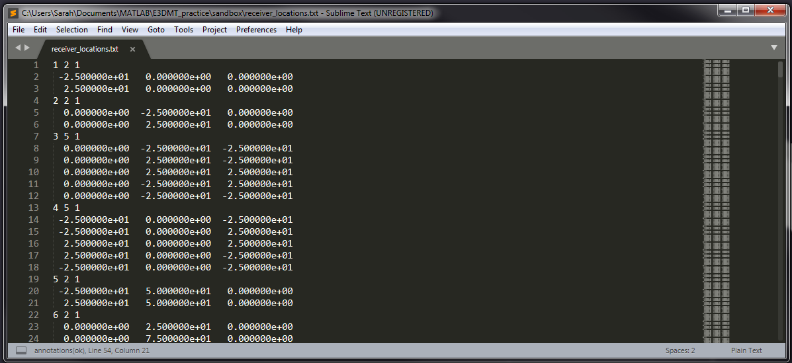

.. _receiverFile:

Receiver File
=============

The exact dimensions of the receivers used to measure electric and magnetic fields for the E3DMT version 2 code are defined within the receiver file. This file is required for both forward modeling and inversion. Electric dipole and inductive loop receivers do not need to be defined in any particular order, however they must be reference properly within the :ref:`survey index file<indexFile>`.

.. note::
    - Bolded entries are fixed flags recognized by the Fortran codes and blue hyperlinked entries are values/regular expressions specified by the user

Format
------

The lines of the receiver file are formatted as follows:

|
| :ref:`RxID<e3dmt_rec_ln1>` :math:`\;` :ref:`N<e3dmt_rec_ln2>` :math:`\;` :ref:`1<e3dmt_rec_ln3>`
| :math:`\;\;\; p_1 \; q_1 \; r_1`
| :math:`\;\;\;\;\;\;\;\; \vdots`
| :math:`\;\; p_N \; q_N \; r_N`
| :ref:`RxID<e3dmt_rec_ln1>` :math:`\;` :ref:`N<e3dmt_rec_ln2>` :math:`\;` :ref:`1<e3dmt_rec_ln3>`
| :math:`\;\;\; p_1 \; q_1 \; r_1`
| :math:`\;\;\;\;\;\;\;\; \vdots`
| :math:`\;\; p_N \; q_N \; r_N`
| :ref:`RxID<e3dmt_rec_ln1>` :math:`\;` :ref:`N<e3dmt_rec_ln2>` :math:`\;` :ref:`1<e3dmt_rec_ln3>`
| :math:`\;\;\; p_1 \; q_1 \; r_1`
| :math:`\;\;\;\;\;\;\;\; \vdots`
| :math:`\;\; p_N \; q_N \; r_N`
|
|

In general, the user should use an ordering of Ex, Ey, Hx, Hy for MT data and Hx, Hy, Hz for ZTEM data but it is not necessary. `Download receiver file example for MT data <https://github.com/ubcgif/e3dmt/raw/e3dmt_v2/assets/MTrecFile.dat>`__ . `Download receiver file example for ZTEM data <https://github.com/ubcgif/e3dmt/raw/e3dmt_v2/assets/ZTEMrecFile.dat>`__ . Below, we show an example of a receiver file which may be used to model MT data.

     Receiver file with electric dipole and inductive loop receivers.

Parameter Descriptions
----------------------

.. _e3dmt_rec_ln1:

    - **RxID:** Each electric dipole (measures E field) or inductive loop (measures H field) receiver is identified by a unique index number. The index numbers should be increasing.

.. _e3dmt_rec_ln2:

    - **N:** The number of points defining the receiver

        - 2 points defines the ends of an electric dipole receiver (measures E field)
        - 5+ points defines the nodes of an inductive loop receiver (measures H field). The first and last node **must** be the same; i.e. you must close the loop.

.. _e3dmt_rec_ln3:

    - **1:** As of May 2018, a flag value of 1 is entered here. In future iterations of the code, this entry may be related to additional functionality.
        
.. _e3dmt_rec_ln4:

    - :math:`\mathbf{p_i \;\; q_i \;\; r_i}`: Easting, Northing and elevation for node locations for the electric dipole or inductive loop receiver.

.. important:: 
    The data may use a labeling convention with X = Easting, Y = Northing and Z = Down, but the node locations are in terms of Easting, Northing and elevation. To correctly define receivers:
        - Define your inductive loop receivers in the CCW direction, as we are using a right-handed coordinate system
        - Define :math:`E_x` receivers from South to North
        - Define :math:`E_y` receivers from West to East
        - Define :math:`H_x` receivers with a dipole moment pointing towards North
        - Define :math:`H_y` receivers with a dipole moment pointing towards East
        - Define :math:`H_z` receivers with a dipole moment downwards

