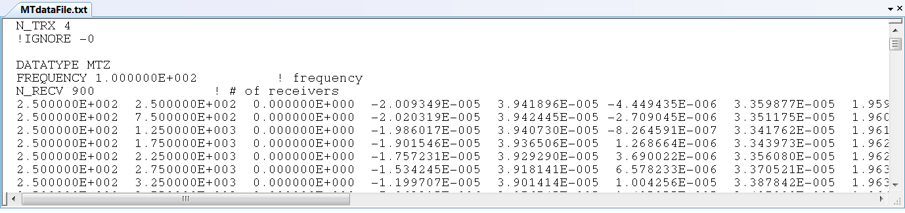

.. _receiverFile:

Receiver File
=============

.. important:: Only relevant to the E3DMT version 2 (2017) code.

The exact dimensions of the receivers used to measure electric and magnetic fields for the E3DMT version 2 code (2017) are defined within the receiver file. This file is required for both forward modeling and inversion. Electric dipole and inductive loop receiver do not need to be defined in any particular order, however the must be reference properly within the :ref:`locations index file<indexFile>`.

.. note:: Bolded entries are fixed flags recognized by the Fortran codes and blue hyperlinked entries are values/regular expressions specified by the user

The lines of the receiver file is formatted as follows:

|
| :ref:`RxID<e3dmt_rec_ln1>` :math:`\;` :ref:`N<e3dmt_rec_ln2>` :math:`\;` :ref:`1<e3dmt_rec_ln3>`
| :math:`\;\; x_1 \; y_1 \; z_1`
| :math:`\;\;\;\;\; \vdots`
| :math:`\;\; x_N \; y_N \; z_N`
| :ref:`RxID<e3dmt_rec_ln1>` :math:`\;` :ref:`N<e3dmt_rec_ln2>` :math:`\;` :ref:`1<e3dmt_rec_ln3>`
| :math:`\;\; x_1 \; y_1 \; z_1`
| :math:`\;\;\;\;\; \vdots`
| :math:`\;\; x_N \; y_N \; z_N`
| :ref:`RxID<e3dmt_rec_ln1>` :math:`\;` :ref:`N<e3dmt_rec_ln2>` :math:`\;` :ref:`1<e3dmt_rec_ln3>`
| :math:`\;\; x_1 \; y_1 \; z_1`
| :math:`\;\;\;\;\; \vdots`
| :math:`\;\; x_N \; y_N \; z_N`
|
|

     Example data file for MTZ data.

Parameter Descriptions
----------------------

.. _e3dmt_rec_ln1:

    - **RxID:** Each electric dipole (measures E field) or inductive loop (measures H field) receiver is identified by a unique index number.

.. _e3dmt_rec_ln2:

    - **N:** The number of points defining the receiver

        - 2 points defines the ends of an electric dipole receiver (measures E field)
        - 5+ points defines the nodes of an inductive loop receiver (measures H field). The first and last node **must** be the same; i.e. you must close the loop.

.. _e3dmt_rec_ln3:

    - **1:** As of May 2018, a flag value of 1 is entered here. In future iterations of the code, this entry may be related to additional functionality.
        
.. _e3dmt_rec_ln4:

    - :math:`\mathbf{x_i \;\; y_i \;\; z_i}`: x, y, z node locations for electric dipole and inductive loop receivers.

