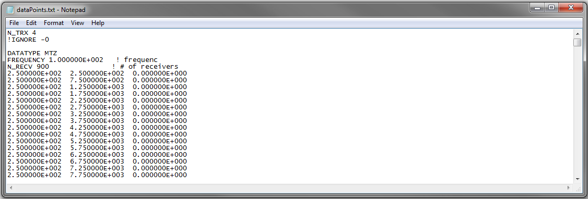

.. _surveyFile:

Survey and Locations File
=========================

.. important:: Only relevant to the E3DMT version 1 (2014 and 2015) code.

The survey and locations file is used to predict synthetic field data (forward modeling) using the E3DMT version 1 code. This file contains all necessary survey information including: the number of transmitters (groups of natural source data), data types, measurement frequencies and receiver locations. 

.. note::
    - Bolded entries are fixed flags recognized by the Fortran codes and blue hyperlinked entries are values/regular expressions specified by the user
    - Each unique data type, frequency and set of observation locations corresponds to a unique "transmitter"; e.g. 2 transmitters must be specified if the same data are collected at the same locations at 2 different frequencies.
    - Each block containing DATATYPE, FREQUENCY, N_RECV and the data array

The lines of a locations file with one or more transmitters is formatted as follows:

| **N_TRX** :math:`\;` :ref:`A<e3dmt_survey_ln1>`
|
| **DATATYPE** :math:`\;` :ref:`B<e3dmt_survey_ln3>`
| **FREQUENCY** :math:`\;` :ref:`C<e3dmt_survey_ln4>`
| **N_RECV** :math:`\;` :ref:`D<e3dmt_survey_ln5>`
| :ref:`Data Array<e3dmt_survey_ln6>`
|
| **DATATYPE** :math:`\;` :ref:`B<e3dmt_survey_ln3>`
| **FREQUENCY** :math:`\;` :ref:`C<e3dmt_survey_ln4>`
| **N_RECV** :math:`\;` :ref:`D<e3dmt_survey_ln5>`
| :ref:`Data Array<e3dmt_survey_ln6>`
|
| :math:`\;\;\;\;\;\;\;\; \vdots`
|
| **DATATYPE** :math:`\;` :ref:`B<e3dmt_survey_ln3>`
| **FREQUENCY** :math:`\;` :ref:`C<e3dmt_survey_ln4>`
| **N_RECV** :math:`\;` :ref:`D<e3dmt_survey_ln5>`
| :ref:`Data Array<e3dmt_survey_ln6>`
|
|

     Example locations file for MTZ data.

Parameter Descriptions
----------------------

.. _e3dmt_survey_ln1:

    - **(A) Number of transmitters:** In line 1, the number of transmitters/groups of natural source EM data is specified. Example: *N_TRX 3*

.. _e3dmt_survey_ln3:

    - **(B) Data type:**. For the data corresponding to each transmitter, this line sets the type of data. Example: *DATATYPE MTZ*. There are 4 options for DATATYPE:

        - "MTZ" - MT data (Both real and imaginary impedance tensor data)
        - "MTT" - ZTEM data (Hx and Hy constant at first receiver location and first receiver station defines base station)
        - "MTE" - ZTEM data where Hx, Hy are calculated at the base station from the initial model
        - "MTH" - ZTEM data (reference is at the data points - no base station)

.. important::
    
    - Data type MTE cannot be used in forward modeling, as there is no initial model initial model in this case.
    - When modeling MT and ZTEM data simultaneously, you must choose either type MTZ and MTT OR MTZ and MTH; e.g. you cannot have MTT and MTH in the same locations file.
        
.. _e3dmt_survey_ln4:

    - **(C) Frequency:** Frequency at which the corresponding set of field observations are made. Example: *FREQUENCY 1.0000E+002*.

.. _e3dmt_survey_ln5:

    - **(D) Number of receivers:** Number of receivers collecting data at the aforementioned frequency for the aforementioned data type. Example: *N_RECV 900*.

.. _e3dmt_survey_ln6:

    - **Data Array:** Contains the locations and field observations for the data specified by :ref:`data type<e3dmt_survey_ln3>`. The number of lines in this array is equal to the number of receivers. The number of columns depends on the type of data specified. The columns for defined for each array are show :ref:`below<surveyFile_data>`.

.. _surveyFile_data:

Data Array
----------

**MT data (DATATYPE = MTZ or MTE) or ZTEM data:**

No matter what data type is being used (DATATYPE = MTZ, MTE, MTT or MTH), each row of the data array contains the x, y and z positions for readings at a particular location, i.e.:

.. math::
    | \; x \; | \; y \; | \; z \; |

.. important::

    - The coordinates are right-handed with X (Easting), Y (Northing) and Z+ (Up).
    - If MT and/or ZTEM data are being modeled, the frequencies do not need to match nor do the locations for each frequency.
    - For **MTT data (ZTEM)**, the first line in the array refers to the base/reference station location. Thus if there are :math:`N` receiver locations specified for a given array with data type "MTT", the forward model will output :math:`N-1` rows of predicted data.
    - For **MTH data (ZTEM)**, measurements Hx, Hy and Hz are taken at the same location. Thus if there are :math:`N` receiver locations specified for a given array with data type "MTH", the forward model will output :math:`N` rows of predicted data.

