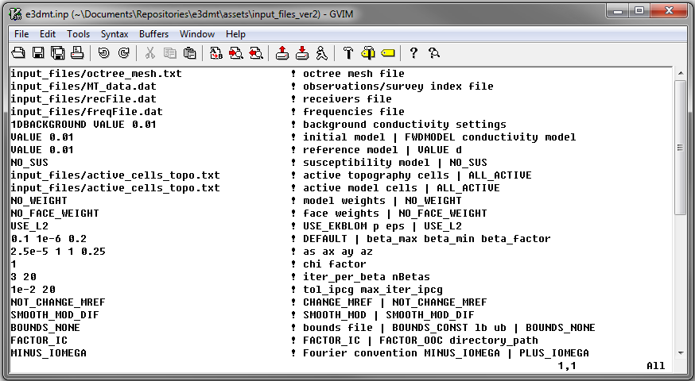

.. _e3dmt_input_inv:

Inversion Input File
====================

.. _e3dmt_input_inv2:

.. important::

    - Both the forward and inverse problems are solved using the **e3dmt_v2** executable program. In both cases, the lines of the input file are the same. However in the case of forward modeling, some lines in the input file are not used by the code and can be given any value.
    - **e3dmt_v2** can accept observation files that use the original (version 1) or version 2 format. This may change the number of lines in the input file.

.. tabularcolumns:: |L|C|C|

+--------+--------------------------------------------------------------+-------------------------------------------------------------------------+
| Line # | Parameter                                                    | Description                                                             |
+========+==============================================================+=========================================================================+
| 1      |:ref:`OcTree Mesh<e3dmt_input_inv2_ln1>`                      | path to octree mesh file                                                |
+--------+--------------------------------------------------------------+-------------------------------------------------------------------------+
| 2a     |:ref:`Observation File<e3dmt_input_inv2_ln2a>`                | path to observations file (v1 and v2)                                   |
+--------+--------------------------------------------------------------+-------------------------------------------------------------------------+
| 2b     |:ref:`Receiver File<e3dmt_input_inv2_ln2b>`                   | path to receivers file (v2 only)                                        |
+--------+--------------------------------------------------------------+-------------------------------------------------------------------------+
| 2c     |:ref:`Frequencies File<e3dmt_input_inv2_ln2c>`                | path to frequencies file (v2 only)                                      |
+--------+--------------------------------------------------------------+-------------------------------------------------------------------------+
| 3      |:ref:`Background Conductivity<e3dmt_input_inv2_ln3>`          | set background conductivity                                             |
+--------+--------------------------------------------------------------+-------------------------------------------------------------------------+
| 4      |:ref:`Initial/FWD Model<e3dmt_input_inv2_ln4>`                | initial model                                                           |
+--------+--------------------------------------------------------------+-------------------------------------------------------------------------+
| 5      |:ref:`Reference Model<e3dmt_input_inv2_ln5>`                  | reference model                                                         |
+--------+--------------------------------------------------------------+-------------------------------------------------------------------------+
| 6      |:ref:`Background Susceptibility Model<e3dmt_input_inv2_ln6>`  | background susceptibility                                               |
+--------+--------------------------------------------------------------+-------------------------------------------------------------------------+
| 7      |:ref:`Active Topography Cells<e3dmt_input_inv2_ln7>`          | topography                                                              |
+--------+--------------------------------------------------------------+-------------------------------------------------------------------------+
| 8      |:ref:`Active Model Cells<e3dmt_input_inv2_ln8>`               | active model cells                                                      |
+--------+--------------------------------------------------------------+-------------------------------------------------------------------------+
| 9      |:ref:`Cell Weights<e3dmt_input_inv2_ln9>`                     | additional cell weights                                                 |
+--------+--------------------------------------------------------------+-------------------------------------------------------------------------+
| 10     |:ref:`Face Weights<e3dmt_input_inv2_ln10>`                    | additional face weights                                                 |
+--------+--------------------------------------------------------------+-------------------------------------------------------------------------+
| 11     |:ref:`Norm Sparseness<e3dmt_input_inv2_ln11>`                 | set parameters to recover smooth, sparse or blocky models               |
+--------+--------------------------------------------------------------+-------------------------------------------------------------------------+
| 12     |:ref:`beta_max beta_min beta_factor<e3dmt_input_inv2_ln12>`   | cooling schedule for beta parameter                                     |
+--------+--------------------------------------------------------------+-------------------------------------------------------------------------+
| 13     |:ref:`alpha_s alpha_x alpha_y alpha_z<e3dmt_input_inv2_ln13>` | weighting constants for smallness and smoothness constraints            |
+--------+--------------------------------------------------------------+-------------------------------------------------------------------------+
| 14     |:ref:`Chi Factor<e3dmt_input_inv2_ln14>`                      | stopping criteria for inversion                                         |
+--------+--------------------------------------------------------------+-------------------------------------------------------------------------+
| 15     |:ref:`iter_per_beta nBetas<e3dmt_input_inv2_ln15>`            | set the number of Gauss-Newton iteration for each beta value            |
+--------+--------------------------------------------------------------+-------------------------------------------------------------------------+
| 16     |:ref:`tol_ipcg max_iter_ipcg<e3dmt_input_inv2_ln16>`          | set the tolerance and number of iterations for Gauss-Newton solve       |
+--------+--------------------------------------------------------------+-------------------------------------------------------------------------+
| 17     |:ref:`Reference Model Update<e3dmt_input_inv2_ln17>`          | reference model                                                         |
+--------+--------------------------------------------------------------+-------------------------------------------------------------------------+
| 18     |:ref:`Hard Constraints<e3dmt_input_inv2_ln18>`                | use *SMOOTH_MOD* or *SMOOTH_MOD_DIFF*                                   |
+--------+--------------------------------------------------------------+-------------------------------------------------------------------------+
| 19     |:ref:`Bounds<e3dmt_input_inv2_ln19>`                          | upper and lower bounds for recovered model                              |
+--------+--------------------------------------------------------------+-------------------------------------------------------------------------+
| 20     |:ref:`Memory Options<e3dmt_input_inv2_ln20>`                  | options for storing factorizations of forward system (RAM vs disk)      |
+--------+--------------------------------------------------------------+-------------------------------------------------------------------------+
| 21     |:ref:`Phase Convention<e3dmt_input_inv2_ln21>`                | set data convention to :math:`e^{-i\omega t}` or :math:`e^{+i\omega t}` |
+--------+--------------------------------------------------------------+-------------------------------------------------------------------------+

    - Example input file for forward modeling (`Download <https://github.com/ubcgif/e3dmt/raw/e3dmt_v2/assets/input_files_ver2/e3dMTver2_fwd.inp>`__ ).
    - Example input file for inversion (`Download <https://github.com/ubcgif/e3dmt/raw/e3dmt_v2/assets/input_files_ver2/e3dMTver2.inp>`__ ).

     Example input file for the inversion program 

Line Descriptions
^^^^^^^^^^^^^^^^^

.. _e3dmt_input_inv2_ln1:

    - **OcTree Mesh:** file path to the :ref:`octree mesh file<octreeFile>`

.. _e3dmt_input_inv2_ln2a:

    - **Observation File:** Sets the path to the observations file. There are two file formats that can be used for the observations file:

        - If the :ref:`version 1 observation file format <obsFile1>` is being used, enter the flag *V1FORMAT* followed by the path to the observations file.
        - If the :ref:`version 2 observation file format <obsFile2>` is being used, simply provide the path to the observation file.

.. _e3dmt_input_inv2_ln2b:

    - **Receiver File:** file path to the receiver file

        - If version 1 file formats are being used, this line does not exist in the input file
        - If version 2 file formats are being used, provide the path to the :ref:`receiver file<receiverFile>`

.. _e3dmt_input_inv2_ln2c:

    - **Frequencies File:** file path to the frequencies file

        - If version 1 file formats are being used, this line does not exist in the input file
        - If version 2 file formats are being used, provide the path to the :ref:`frequencies file<freqFile>`

.. _e3dmt_input_inv2_ln3:

    - **Background Conductivity:** On this line, the user first specifies a flag for the background conductivity model ('1DBACKGROUND' or '3DBACKGROUND'). Next, the user may supply the file path to the corresponding conductivity model (ex: *1DBACKGROUND model1d.con*), or if a homogeneous background conductivity is being used, the user may enter "VALUE" followed by a space and a numerical value (ex: *3DBACKGROUND VALUE 0.01*). The way the background model is used to determine the boundary conditions for solving NSEM problem depends on the active topography cells options on :ref:`line 9<e3dmt_input_inv2_ln7>`. Before continuing, the user is urged to read the section on :ref:`boundary conditions <e3dmt_input_inv2_bc>`.

.. important::

    - The number of layers in the 1D model for E3DMT ver 2 must equal the number of underlying mesh cells in the vertical direction. Thus if underlying mesh for the OcTree mesh is 1028 by 1028 by 512, the 1D model must have 512 layer conductivities.
    - The boundary conditions computed using 1D models is only accurate when surface topography is minimal. In the case where surface topography is significant, 3D background models are suggested.

.. _e3dmt_input_inv2_ln4:

    - **Initial/FWD Model:** On this line we specify either the starting model for the inversion or the conductivity model for the forward modeling. On this line, there are 3 possible options:

        - If the program is being used to forward model data, the flag 'FWDMODEL' is entered followed by the path to the conductivity model.
        - If the program is being used to invert data, only the path to a conductivity model is required; e.g. inversion is assumed unless otherwise specified.
        - If a homogeneous conductivity value is being used as the starting model for an inversion, the user can enter "VALUE" followed by a space and a numerical value; example "VALUE 0.01".

.. important::

    If data are only being forward modeled, only the :ref:`background susceptibility model<e3dmt_input_inv2_ln6>`, :ref:`active topography cells<e3dmt_input_inv2_ln7>`, :ref:`memory options <e3dmt_input_inv2_ln20>` and :ref:`phase convention <e3dmt_input_inv2_ln20>` fields are relevant. **However**, the remaining fields must not be empty and must have correct syntax for the code to run.

.. _e3dmt_input_inv2_ln5:

    - **Reference Model:** The user may supply the file path to a reference conductivity model. If a homogeneous conductivity value is being used for all active cells, the user can enter "VALUE" followed by a space and a numerical value; example "VALUE 0.01".

.. _e3dmt_input_inv2_ln6:

    - **Background Susceptibility Model:** The user may supply the file path to a background susceptibility model. If the Earth is non-magnetic, the user may use the flag "NO_SUS".

.. _e3dmt_input_inv2_ln7:

    - **Active Topography Cells:** Here the user specifies the cells which lie below the surface topography. To do this, the user supplies the file path to an active cells model file. The active cells model has values 1 for cells lying below the surface topography and values 0 for cells lying above.

.. _e3dmt_input_inv2_ln8:

    - **Active Model Cells:** Here, the user can choose to specify the model cells which are active during the inversion. To do this, the user may supply the file path to an active cells model file or type "ALL_ACTIVE". The active model cells are given a value of 1 and inactive cells are given a value of 0. Recovered values for inactive cells are provided by the background conductivity model. All cells lying above surface topography will have a conductivity value equal to air values.

.. _e3dmt_input_inv2_ln9:

    - **Cell Weights:** Here, the user specifies whether cell weights are supplied. The user has two options:

        - **No cell weights:** the user enters the flag *NO_WEIGHT*.
        - **Weights file:** the user provides the file path to a :ref:`cell weights file <weightsFile>`  

.. _e3dmt_input_inv2_ln10:

    - **Face Weights:** Here, the user specifies whether face weights are supplied. The user has three options:

        - **No face weights:** the user enters the flag *NO_FACE_WEIGHT*
        - **Simple weights:** the user enters the flag *FACE_WEIGHTS*, THEN the number of layers for which horizontal face weights are applied, followed by the weights for each layer; for example "*FACE_WEIGHTS 3 100 50 25*" sets horizontal interface weights for three layer below the surface. Yes surface topography is taken into account.
        - **Weights file:** the user enters the flag *WEIGHTS_FILE* followed by the file path to a face weights file :ref:`cell weights file <weightsFile>`. *NOTE* this option has not been added as of 2019-03-14 but will be added in the future.

.. _e3dmt_input_inv2_ln11:

    - **Sparseness:** The sparseness of the recovered model is determined by the terms within the `model objective function <http://giftoolscookbook.readthedocs.io/en/latest/content/fundamentals/Norms.html>`__ . A standard approach is to use an L2-norm for all terms

        - To use the L2-norm, enter the flag 'USE_L2'
        - To specify the Ekblom norm, enter the flag 'USE_EKBLOM' followed by values for :math:`p` and :math:`\varepsilon` where the Ekblom norm is given by:

.. math::
    \sum_{i=1}^M \, (\sigma_i^2 + \varepsilon^2)^{p/2} \;\;\; \textrm{s.t.} \;\;\; 1\leq p \leq 2, \; \varepsilon > 0

.. _e3dmt_input_inv2_ln12:

    - **beta_max beta_min beta_factor:** Here, the user specifies protocols for the trade-off parameter (beta). *beta_max* is the initial value of beta. *beta_min* is generally used to denote the minimum allowable trade-off parameter the program can use before quitting. For this code however, the minimum beta is determined through the *nBeta* parameter on :ref:`line 15 <e3dmt_input_inv2_ln15>` and the *beta_min* parameter has no function. *beta_factor* defines the factor by which beta is decreased at each iteration; example "1E4 10 0.2". The user may also enter "DEFAULT" if they wish to have beta calculated automatically. See theory on :ref:`cooling schedule <theory_cooling>`.

.. _e3dmt_input_inv2_ln13:

    - **alpha_s alpha_x alpha_y alpha_z:** `Alpha parameters <http://giftoolscookbook.readthedocs.io/en/latest/content/fundamentals/Alphas.html>`__ . Here, the user specifies the relative weighting between the smallness and smoothness component penalties on the recovered models.

.. _e3dmt_input_inv2_ln14:

    - **Chi Factor:** The chi factor defines the target misfit for the inversion (*DEFAULT = 1*); see the `GIFtools cookbook <http://giftoolscookbook.readthedocs.io/en/latest/content/fundamentals/Beta.html>`__ . Where :math:`\phi_d` is the :ref:`data misfit <theory_inv_misfit>` , :math:`N` is the number of data and :math:`\chi_{fact}` is the chi factor, the inversion terminates when:

.. math::
    \phi_d \leq \chi_{fact} \times N 

.. _e3dmt_input_inv2_ln15:

    - **iter_per_beta nBetas:** Here, *iter_per_beta* is the number of Gauss-Newton iterations per beta value. *nBetas* is the number of times the inverse problem is solved for smaller and smaller trade-off parameters until it quits. See theory section for :ref:`cooling schedule <theory_cooling>` and :ref:`Gauss-Newton update <theory_GN>`.

.. _e3dmt_input_inv2_ln16:

    - **tol_ipcg max_iter_ipcg:** Here, the user specifies solver parameters. *tol_ipcg* defines how well the iterative solver does when solving for :math:`\delta m` and *max_iter_ipcg* is the maximum iterations of incomplete-preconditioned-conjugate gradient. See theory on :ref:`Gauss-Newton solve <theory_IPCG>`

.. _e3dmt_input_inv2_ln17:

    - **Reference Model Update:** If the flag "NOT_CHANGE_MREF" is entered, the reference model remains unchanged throughout the inversion. If the flag "CHANGE_MREF" is entered, the current model is set as the reference model for the next beta iteration.

.. _e3dmt_input_inv2_ln18:

    - **Hard Constraints:** SMOOTH_MOD runs the inversion without implementing a reference model (essential :math:`m_{ref}=0`). "SMOOTH_MOD_DIF" constrains the inversion in the smallness and smoothness terms using a reference model.

.. _e3dmt_input_inv2_ln19:

    - **Bounds:** Bound constraints on the recovered model.

        - Enter "BOUNDS_NONE" if the inversion is unbounded, or if there is no a-prior information about the subsurface model.
        - Choose "BOUNDS_CONST" and enter the values of the minimum and maximum model conductivity; example "BOUNDS_CONST 1E-6 0.1".
        - Enter the file path to a :ref:`bounds file <boundsFile>`

.. _e3dmt_input_inv2_ln20:

    - **Memory Options:** This code uses a factorization to solve the forward system at each frequency. These factorizations must be stored. By using the flag 'FACTOR_IC' (in core), factorizations are stored within a computer's RAM. Although this is faster, larger problems cannot be solved if insufficient temporary memory is available. The factorizations are stored in permanent memory (disk/solid state) if the flag 'FACTOR_OOC' (out of core) is used followed by the path to a directory. This is slower because the program must read these files many times. The second options is ill-advised if files are being transferred over a network.

.. _e3dmt_input_inv2_ln21:

    - **Phase Convention:** If the predicted/observed data have a sign convention :math:`e^{+i \omega t}` use the flag 'PLUS_IOMEGA'. If the predicted/observed data have a sign convention :math:`e^{-i \omega t}` use the flag 'MINUS_IOMEGA'.

.. _e3dmt_input_inv2_bc:

Details regarding boundary conditions
^^^^^^^^^^^^^^^^^^^^^^^^^^^^^^^^^^^^^

The way background models are used to determine the boundary conditions for the problem depends on :ref:`background conductivity <e3dmt_input_inv2_ln3>` and the :ref:`active topography cells <e3dmt_input_inv2_ln7>`. This can be explained as follows:

**1DBACKGROUND:**

        - Assume *VALUE* is used to define the 1D :ref:`background conductivity model <e3dmt_input_inv2_ln3>` and the flag *ALL_ACTIVE* is used to define :ref:`active topography cells <e3dmt_input_inv2_ln7>`. Then the boundary conditions are obtained by solving the fields for a whole space. This approach is strongly discouraged!

        - Assume *VALUE* is used to define the 1D :ref:`background conductivity model <e3dmt_input_inv2_ln3>` and an *active cells model* is used to define the :ref:`active topography cells <e3dmt_input_inv2_ln7>`. Then the highest surface elevation in the active cells model is used as the surface elevation for the 1D model. Below this surface, the background conductivity is equal to the specified value. Above this surface, the background conductivity is set to air.

        - Assume a *1D model* defines the :ref:`background conductivity model <e3dmt_input_inv2_ln3>` and the flag *ALL_ACTIVE* is used to define :ref:`active topography cells <e3dmt_input_inv2_ln7>`. The top of the 1D model corresponds to the top of the OcTree mesh when solving the 1D problem. As a result, it is important to include air cells in the 1D model.

        - Assume a *1D model* defines the :ref:`background conductivity model <e3dmt_input_inv2_ln3>` and an *active cells model* is used to define the :ref:`active topography cells <e3dmt_input_inv2_ln7>`. Then the highest surface elevation in the active cells model is used as the surface elevation for the 1D model. The 1D problem is still solved and the top of the 1D model still corresponds to the top of the OcTree mesh. However, all layers above the surface are set to air regardless of the values specified in the 1D model.

**3DBACKGROUND:**

        - Assume *VALUE* is used to define the 3D :ref:`background conductivity model <e3dmt_input_inv2_ln3>` and the flag *ALL_ACTIVE* is used to define :ref:`active topography cells <e3dmt_input_inv2_ln7>`. Then the boundary conditions are obtained by solving the fields for a whole space. This approach is strongly discouraged!

        - Assume *VALUE* is used to define the 3D :ref:`background conductivity model <e3dmt_input_inv2_ln3>` and an *active cells model* is used to define the :ref:`active topography cells <e3dmt_input_inv2_ln7>`. A 3D problem is solved where all cells below the surface are set to the specified value and all the cells above the surface are set to air.

        - Assume a *3D model* defines the :ref:`background conductivity model <e3dmt_input_inv2_ln3>` and the flag *ALL_ACTIVE* is used to define :ref:`active topography cells <e3dmt_input_inv2_ln7>`. A 3D problem is solved for the specified background model.

        - Assume a *1D model* defines the :ref:`background conductivity model <e3dmt_input_inv2_ln3>` and an *active cells model* is used to define the :ref:`active topography cells <e3dmt_input_inv2_ln7>`. A 3D problem is solved where all cells above the surface are set to air, regardless of the values specified in the model.
