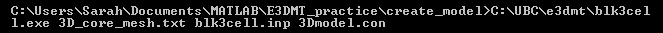
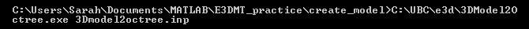
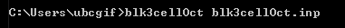

.. _e3dmt_model:

Create Model
============

.. note:: Although separate executables were designed for each version of the code, the input and output file formats are the same. As a result, the approach for creating models using either package is acceptable.

Version 1 (2014 and 2015)
-------------------------

:ref:`Models<modelFile>` (conductivity/susceptibility/active) used within the forward modeling and inversion codes are generated by carrying out a 2-step process. First, the program **blk3cell.exe** is executed to create a model on the base 3D :ref:`tensor mesh<tensorFile>` (**3D_mesh.txt**) which was output by the code :ref:`MTcreate_octree_mesh_e3d.exe<e3dmt_octree>`; see :ref:`outputs<e3dmt_octree_output>`. This model is comprised of a set of overlapping rectangular blocks whose locations, dimensions and values are specified within the :ref:`input file<e3dmt_blk3cell_input>`; referred to as **blk3cell.inp**.

Next, **3Dmodel2octree.exe** is used to interpolate the tensor model onto an :ref:`Octree mesh<octreeFile>`. The tensor mesh (**3D_mesh.txt**), tensor :ref:`model<modelFile>` (**3Dmodel.con**) and octree mesh (**octree_mesh.txt**) are all specified in another :ref:`input file<e3dmt_3Dmodel2octree_input>`; referred to here as **3Dmodel2octree.inp**.

.. note:: This workflow can also be used to create a :ref:`model weights<weightsFile>` file.

.. _e3dmt_model_blk3cell:

Running blk3cell
^^^^^^^^^^^^^^^^

To generate the tensor model on the core tensor mesh, open a command window. In order, enter the path to **blk3cell.exe**, followed by the path to the tensor mesh file name (**3D_mesh.txt**), followed by the path to the :ref:`input file<e3dmt_blk3cell_input>` (denoted here as**blk3cell.inp**), followed by the desired name (or full path) for the output model file (denoted here as**3Dmodel.con**), all separated by spaces.

**blk3cell.exe** outputs a :ref:`model<modelFile>` (**3Dmodel.con**) which contains a single value for each cell in the tensor mesh **3D_mesh.txt**.

.. warning:: It is not advisable to image models on the base tensor mesh as they can be prohibitively large (>> 1M cells).

.. _e3dmt_model_3DtoOctree:

Running 3Dmodel2Octree
^^^^^^^^^^^^^^^^^^^^^^

To interpolate the model from a :ref:`tensor mesh<tensorFile>` to an :ref:`Octree mesh<octreeFile>`, open a command window. Enter the path to **3DModel2Octree.exe** followed by a space followed by the path to the :ref:`input file<e3dmt_3Dmodel2octree_input>`; referred to here as **3Dmodel2octree.inp**.

**3Dmodel2Octree.exe** outputs a :ref:`model file<modelFile>` (**Output model name**) which has been interpolated from the base :ref:`tensor mesh<tensorFile>` to the :ref:`Octree mesh<octreeFile>`.

Version 2 (2017)
----------------

:ref:`Models<modelFile>` (conductivity/susceptibility/active) used within the this programming package are generated using **blk3cellOct.exe**. The model output by the executable is comprised of a set of overlapping rectangular blocks whose locations, dimensions and values are specified within the :ref:`input file<e3dmt_3Dmodel2octree_input>`; denoted here as **blk3cellOct.inp**.

.. note:: This workflow can also be used to create a model :ref:`weights file<weightsFile>`.

To generate the model on the octree mesh, open a command window. Enter the path to **blk3cellOct.exe**, followed by the path to the :ref:`input file<e3dmt_3Dmodel2octree_input>`; denoted here as **blk3cellOct.inp**. 

**blk3cellOct.exe** outputs a :ref:`model<modelFile>` which contains a single value for each cell in the octree mesh.

