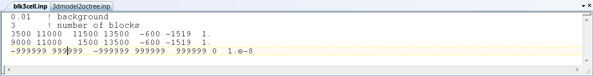
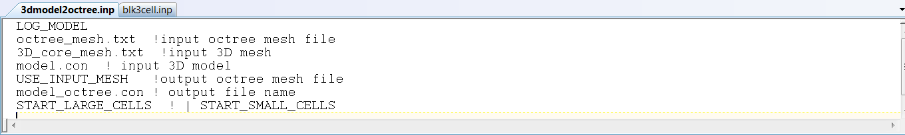

.. _e3dmt_model:

Create Model
============

Conductivity models used within the forward modeling and inversion codes are generated by carrying out a 2-step process. First, the program **blk3cell.exe** is executed to creates a conductivity model on the core 3D tensor mesh which was output by the code :ref:`MTcreate_octree_mesh_e3d.exe<e3dmt_octree>`; see :ref:`outputs<e3dmt_octree_output>`. This model is comprised of a set of overlapping rectangular blocks (specified in **blk3cell.inp**), each with a distinct conductivity value (specified in **3Dmodel.con**).

Next, 

Running blk3cell
----------------

To generate the tensor model on the core tensor mesh, open a command line window in the directory which contains the input files (**blk3cell.inp** and **3D_core_mesh.txt**). In order, enter the path to **blk3cell.exe**, followed by the core mesh file name (**3D_core_mesh.txt**), followed by the input file (**blk3cell.inp**), followed by the desired name for the output conductivity model file (**3Dmodel.con**), all separated by spaces.

.. figure:: images/run_create_model.png
     :align: center
     :width: 700

.. _e3dmt_blk3cell_input:

Input File
^^^^^^^^^^

The file **blk3cell.inp** defines the conductivity model. The user specifies the location, dimensions and conductivities for a set of blocks. All undefined regions cells within the mesh are set to the background conductivity value. The format for this file is as follows:

|
| :math:`\sigma_b \;\;\;\;\;\;\;\;\;\;\;\;\;\;\;\;\;\;\;\;\;\;\;\;`  ! background conductivity
| :math:`N \;\;\;\;\;\;\;\;\;\;\;\;\;\;\;\;\;\;\;\;\;\;\;\;`  ! number of blocks
| :math:`x_1^{(1)} \;\;  x_2^{(1)} \;\; y_1^{(1)} \;\; y_2^{(1)} \;\; z_1^{(1)} \;\; z_2^{(1)} \;\; \sigma^{(1)} \;\;\;\;\;\;\;\;\;\;\;\;` ! Block 1
| :math:`x_1^{(2)} \;\;  x_2^{(2)} \;\; y_1^{(2)} \;\; y_2^{(2)} \;\; z_1^{(2)} \;\; z_2^{(2)} \;\; \sigma^{(2)} \;\;\;\;\;\;\;\;\;\;\;\;` ! Block 2
| :math:`\;\;\;\;\;\;\;\;\;\;\;\;\;\;\;\;\;\;\;\;\;\;\;\; \vdots`
| :math:`x_1^{(N)} \;\;  x_2^{(N)} \;\; y_1^{(N)} \;\; y_2^{(N)} \;\; z_1^{(N)} \;\; z_2^{(N)} \;\; \sigma^{(N)} \;\;\;\;\;\;\;\;\;\;\;\;` ! Block N
|
|
|

where superscript :math:`(i)` for :math:`i=1,2,...,N` refers to a particular block. :math:`x_1,x_2,y_1,y_2,z_1` and :math:`z_2` define the nodes of each block and :math:`\sigma` defines the conductivity. An example is shown below.

Output
^^^^^^

**blk3cell.inp** outputs a conductivity model which contain a single conductivity value for each cell in the tensor mesh **3D_core_mesh.txt**.

Running 3Dmodel2Octree
----------------------

To interpolate the model from a tensor mesh to an Octree mesh, open a command line window in the directory which contains the input files (**Model2Octree.inp**, **octree_mesh.txt**, **3D_core_mesh.txt** and **3Dmodel.con**). Enter the path to **3DModel2Octree.exe** followed by a space followed by **Model2Octree.inp**; the mesh and conductivity information is specified in the input file.

Input File
^^^^^^^^^^

The file **Model2Octree.inp** specifies the tensor mesh and

