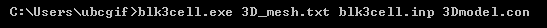

.. _e3dmt_model:

Create Model
============

To create conductivity models which are used as part of the forward modeling or inversion codes, the program **blk3cell.exe** is executed. This programs creates a conductivity model on the core 3D tensor mesh which is output by the code :ref:`MTcreate_octree_mesh_e3d.exe<e3dmt_octree>`; see :ref:`outputs<e3dmt_octree_output>`. The model is comprised of a set of overlapping rectangular blocks (specified in **blk3cell.inp**), each with a distinct conductivity value (specified in **3Dmodel.con**.

Running blk3cell
----------------

To generate the tensor model on the core tensor mesh, open a command line window in the directory which contains the :ref:`input files<e3dmt_blk3cell_input>`. In order, enter the path to **blk3cell.exe**, followed by the core tensor mesh file name (**3D_core_mesh.txt**), followed by the input file (**blk3cell.inp**), followed by the conductivities file (**3Dmodel.con**), all separated by spaces.

.. _e3dmt_blk3cell_input:

Input Files
-----------

blk3cell.inp
^^^^^^^^^^^^

3Dmodel.con
^^^^^^^^^^^

