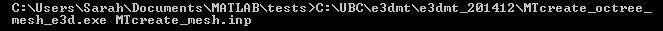

.. _e3dmt_octree:

Create OcTree Mesh
==================

Both versions of the E3DMT code are capable of generating OcTree meshes from the survey file. However, separate executables were made because the survey file formats for each package are different.

Version 1 (2014 and 2015)
-------------------------

:ref:`OcTree meshes<octreeFile>` used in the E3DMT version 1 code are created using the program **MTcreate_octree_mesh_e3d.exe**. Parameters necessary for defining the OcTree mesh are set in the :ref:`input file<e3dmt_input_octree>`; referred to here as **MTcreate_mesh.inp**.

To generate the OcTree mesh, open a command window. Type the path to the code **MTcreate_octree_mesh_e3d.exe**, followed by a space, followed by the path to the input file.

.. _e3dmt_octree_output:

The program **MTcreate_octree_mesh_e3d.exe** creates 5 output files:

    - **3D_mesh.txt:** the underlying regular :ref:`tensor mesh<tensorFile>`. This mesh is comprised of the smallest cell size and is very large (>> 1M cells). As a result, it is unwise to plot this mesh.

    - **3D_core_mesh.txt:** A 3D regular :ref:`tensor mesh<tensorFile>` defining the core region. 

    - **octree_mesh.txt:** :ref:`OcTree mesh<octreeFile>` used in the forward modeling and inversion codes

    - **active_cells.txt:** :ref:`active cells model<modelFile>` on the OcTree mesh. Cells are active if assigned a value of 1 and inactive if assigned a value of 0 

    - **create_mesh.log:** log file

.. _e3dmt_octree2:

Version 2 (2017)
----------------

:ref:`OcTree meshes<octreeFile>` used in the E3DMT version 1 code are created using the program **octree_mesh_mt.exe**. Parameters necessary for defining the OcTree mesh are set in the :ref:`input file<e3dmt_input_octree2>`; referred to here as **MTcreate_mesh.inp**.

To generate an OcTree mesh, open a command window. Type the path to the code **octree_mesh_mt.exe**, followed by a space, followed by the path to the input file.

.. _e3dmt_octree2_output:

The program **octree_mesh_mt.exe** creates 5 output files:

    - **3D_mesh.txt:** the underlying regular :ref:`tensor mesh<tensorFile>`. This mesh is comprised of the smallest cell size and is very large (>> 1M cells). As a result, it is unwise to plot this mesh.

    - **3D_core_mesh.txt:** A 3D regular :ref:`tensor mesh<tensorFile>` defining the core region. 

    - **octree_mesh.txt:** :ref:`OcTree mesh<octreeFile>` used in the forward modeling and inversion codes

    - **active_cells.txt:** :ref:`active cells model<modelFile>` on the OcTree mesh. Cells are active if assigned a value of 1 and inactive if assigned a value of 0 

    - **E3DMesh.log:** log file

