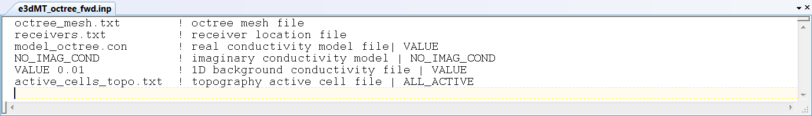

.. _e3dmt_fwd:

Forward Modeling Program
========================

The forward problem is solved using the executable program **e3dMTfwd.exe**. 

Running the Program
-------------------

**NEED A PRACTICE RUN**

Input
-----

The lines of input file (**e3dMT_octree_fwd.inp**) are formatted as follows:

| :ref:`OcTree Mesh<e3dmt_fwd_ln1>`
| :ref:`Receiver Locations<e3dmt_fwd_ln2>`
| :ref:`Real Conductivity<e3dmt_fwd_ln3>`
| :ref:`Imaginary Conductivity<e3dmt_fwd_ln4>`
| :ref:`1D Background Conductivity<e3dmt_fwd_ln5>`
| :ref:`Topography<e3dmt_fwd_ln6>`
|
|

     Example input file for solving the forward problem.

**Line Descriptions:**

.. _e3dmt_fwd_ln1:

    - **OcTree Mesh:** file path to the OcTree mesh file

.. _e3dmt_fwd_ln2:

    - **Receiver Locations:** file path to the :ref:`MT data file<dataFile>`. Within this file, only the locations of the receivers are required; see :ref:`data points file<dataFile_points>`.

.. _e3dmt_fwd_ln3:

    - **Real Conductivity:** file path to the conductivity model. If complex conductivities are being used, this model represents real-valued conductivities.

.. _e3dmt_fwd_ln4:

    - **Imaginary Conductivity:** If the conductivity model used in the forward simulation is strictly real-valued, the user may enter "NO_IMAG_COND" on this line. Otherwise, the user enters the file path to the imaginary conductivity model.

.. _e3dmt_fwd_ln5:

    - **1D Background Conductivity:** The user may supply the file path to a 1D background conductivity model (**EXPLAIN AND LINK**). If a homogeneous background conductivity is being used, the user enters "VALUE" followed by a space and a numerical value; example "VALUE 0.01"

.. _e3dmt_fwd_ln6:

    - **Topography:** The user may supply the file path to an active cells model file or type "ALL_ACTIVE". The active cells model has values 1 for cells lying below the surface topography and values 0 for cells lying above.

.. _e3dmt_fwd_output:

Output Files
------------

The program **e3dMTfwd.exe** creates 2 output files:

    - **MT_data.txt:** data predicted using the model conductivity model provided (**REAL/IMAGINARY? WHAT ARE THE UNITS?**)

    - **ed3MT_octree_fwd.log:** log file

