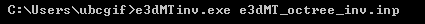
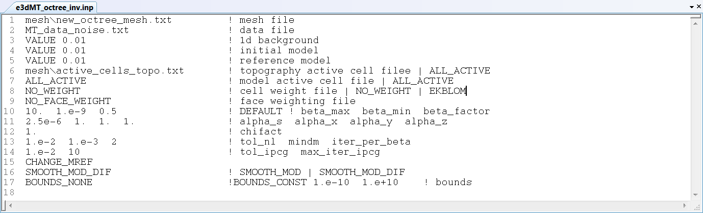

.. _e3dmt_inv:

Inversion Program
=================

The inversion is run using the executable program **e3dMTinv.exe**. Parameters necessary for running the forward modeling code are set in the file **e3dMT_octree_inv.inp**.

Running the Program
-------------------

To run the inversion, open a command line window. Type the path to the code **e3dMTinv.exe**, followed by a space, followed by the path to the input file.

Input
-----

The lines of input file (**e3dMT_octree_inv.inp**) are formatted as follows:

| :ref:`OcTree Mesh<e3dmt_inv_ln1>`
| :ref:`Observation File<e3dmt_inv_ln2>`
| :ref:`1D Background Conductivity<e3dmt_inv_ln3>`
| :ref:`Initial Model<e3dmt_inv_ln4>`
| :ref:`Reference Model<e3dmt_inv_ln5>`
| :ref:`Active Topography Cells<e3dmt_inv_ln6>`
| :ref:`Active Model Cells<e3dmt_inv_ln7>`
| :ref:`Cell Weights<e3dmt_inv_ln8>`
| :ref:`Face Weights<e3dmt_inv_ln9>`
| :ref:`beta_max beta_min beta_factor<e3dmt_inv_ln10>`
| :ref:`alpha_s alpha_x alpha_y alpha_z<e3dmt_inv_ln11>`
| :ref:`Chi Factor<e3dmt_inv_ln12>`
| :ref:`tol_nl mindm iter_per_beta<e3dmt_inv_ln13>`
| :ref:`tol_ipcg max_iter_ipcg<e3dmt_inv_ln14>`
| :ref:`Reference Model Update<e3dmt_inv_ln15>`
| :ref:`Hard Constraints<e3dmt_inv_ln16>`
| :ref:`Bounds<e3dmt_inv_ln17>`
|
|

     Example input file for the inversion program.

**Line Descriptions:**

.. _e3dmt_inv_ln1:

    - **OcTree Mesh:** file path to the OcTree mesh file

.. _e3dmt_inv_ln2:

    - **Observation File:** file path to the :ref:`MT data file<dataFile>`

.. _e3dmt_inv_ln3:

    - **1D Background Conductivity:** The user may supply the file path to a 1D background conductivity model (**EXPLAIN AND LINK**). If a homogeneous background conductivity is being used, the user enters "VALUE" followed by a space and a numerical value; example "VALUE 0.01"

.. _e3dmt_inv_ln4:

    - **Initial Model:** The user may supply the file path to an initial conductivity model. If a homogeneous conductivity value is being used for all active cells, the user can enter "VALUE" followed by a space and a numerical value; example "VALUE 0.01".

.. _e3dmt_inv_ln5:

    - **Reference Model:** The user may supply the file path to a reference conductivity model. If a homogeneous conductivity value is being used for all active cells, the user can enter "VALUE" followed by a space and a numerical value; example "VALUE 0.01".

.. _e3dmt_inv_ln6:

    - **Active Topography Cells:** Here, the user can choose to specify the cells which lie below the surface topography. To do this, the user may supply the file path to an active cells model file or type "ALL_ACTIVE". The active cells model has values 1 for cells lying below the surface topography and values 0 for cells lying above.

.. _e3dmt_inv_ln7:

    - **Active Model Cells:** Here, the user can choose to specify the model cells which are active during the inversion. To do this, the user may supply the file path to an active cells model file or type "ALL_ACTIVE". The active cells model has values 1 for cells lying below the surface topography and values 0 for cells lying above. Values for inactive cells are provided by the background conductivity model.

.. _e3dmt_inv_ln8:

    - **Cell Weights:** Here, the user specifies whether cell weights are supplied. If so, the user provides the file path to a cell weights file (**LINK**). If no additional cell weights are supplied, the user enters "NO_WEIGHT".

.. _e3dmt_inv_ln9:

    - **Face Weights:** Here, the user specifies whether face weights are supplied. If so, the user provides the file path to a face weights file (**LINK**). If no additional cell weights are supplied, the user enters "NO_FACE_WEIGHT". The user may also enter "EKBLOM" for 1-norm approximation to recover sharper edges.

.. _e3dmt_inv_ln10:

    - **beta_max beta_min beta_factor:** Here, the user specifies protocols for the trade-off parameter (beta). *beta_max* is the initial value of beta, *beta_min* is the minimum allowable beta the program can use before quitting and *beta_factor* defines the factor by which beta is decreased at each iteration; example "1E4 10 5". The user may also enter "DEFAULT" if they wish to have beta calculated automatically.

.. _e3dmt_inv_ln11:

    - **alpha_s alpha_x alpha_y alpha_z:** Alpha parameters (**LINK** section 2.5). Here, the user specifies the relative weighting between the smallness and smoothness component penalties on the recovered models.

.. _e3dmt_inv_ln12:

    - **Chi Factor:** The chi factor defines the target misfit for the inversion. A chi factor of 1 means the target misfit is equal to the total number of data observations.

.. _e3dmt_inv_ln13:

	- **tol_nl mindm iter_per_beta:** Here, the user specifies the number of Newton iterations. *tol_nl* is the Newton iteration tolerance (how close the gradient is to zero), *mindm* is the minimum model perturbation :math:`\delta m` allowed and iter_per_beta is the number of iterations per beta value.

.. _e3dmt_inv_ln14:

	- **tol_ipcg max_iter_ipcg:** Here, the user specifies solver parameters. *tol_ipcg* defines how well the iterative solver does when solving for :math:`\delta m` and *max_item_ipcg* is the maximum iterations of incomplete-preconditioned-conjugate gradient.

.. _e3dmt_inv_ln15:

	- **Reference Model Update:** Here, the user specifies whether the reference model is updated at each inversion step result. If so, enter "CHANGE_MREF". If not, enter "NOT_CHANGE_MREF".

.. _e3dmt_inv_ln16:

	- **Hard Constraints:** Choose to run the inversion without implementing a reference model (essential :math:`m_{ref}=0` (**SHOULDN'T THIS BE SMALLNESS ONLY**). Choose "SMOOTH_MODEL_DIF" to constrain the inversion using a reference model.

.. _e3dmt_inv_ln17:

	- **Bounds:** Bound constraints on the recovered model. Choose "BOUNDS_CONST" and enter the values of the minimum and maximum model conductivity; example "BOUNDS_CONST 1E-6 0.1". Enter "BOUNDS_NONE" if the inversion is unbounded, or if there is no a-prior information about the subsurface model.

Output Files
------------

The program **e3dMTinv.exe** creates the following output files:

    - **inv.con:** recovered conductivity models

    - **dpred.txt** predicted data for each recovered conductivity model

    - **e3dMT_octree_inv.log:** log file for the inversion

    - **e3dMT_octree_inv.out:**

