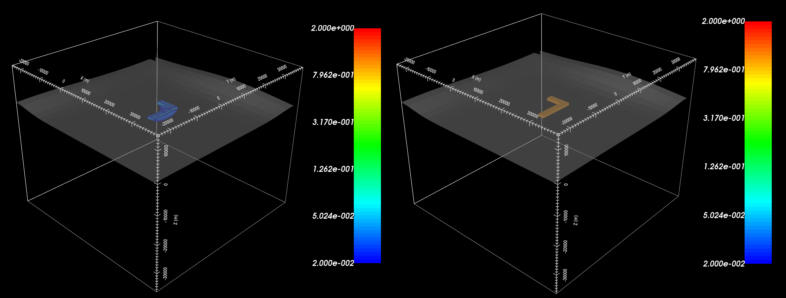
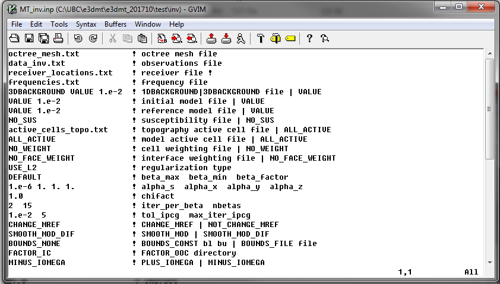

.. _e3dmt_inv:

Inversion Program
=================

Version 1 (2014 and 2015)
-------------------------

There are two options for inversion executables, both of which require parameters set through an input file (**e3dMT_octree_inv.inp**). The two executable files are:

    - **e3dMTinv.exe:** Uses the MUMPS direct solver (2014). Faster but larger memory requirements
    - **e3dMTinv_iter.exe:** Uses an iterative solver (2015). Slower run-time but less memory requirements

Running the Program
^^^^^^^^^^^^^^^^^^^

To run the inversion, open a command line window and type the following:

.. figure:: images/run_e3dmt_inv_iter.png
     :align: center
     :width: 700

The *mpiexec* call is used for parallelization. This is followed by the flag *-n*, then the number of frequencies (*"nFreq"*). This is followed by the inversion executable and the corresponding input file.

Units
^^^^^

**Input:**

    - **MT data:** Real and imaginary components of impedance tensor entries (V/A)
    - **ZTEM data:** Real and imaginary components of transfer function entries (unitless)
    - **Reference/starting conductivity model:** S/m 
    - **Background susceptibility model:** SI
    - **Model/interface weights:** unitless

.. important:: The current version of the code requires both components for all entries within the impedance tensor. For example, the user cannot invert only the off-diagonal impedance tensor data. Instead the user must supply large uncertainties for the diagonal data.

**Output:**

    - **Conductivity model:** S/m

Input File
^^^^^^^^^^

The lines of input file (**e3dMT_octree_inv.inp**) are formatted as follows:

| :ref:`OcTree Mesh<e3dmt_inv_ln1>`
| :ref:`Observation File<e3dmt_inv_ln2>`
| :ref:`1D Background Conductivity<e3dmt_inv_ln3>`
| :ref:`Initial Model<e3dmt_inv_ln4>`
| :ref:`Reference Model<e3dmt_inv_ln5>`
| :ref:`Background Susceptibility Model<e3dmt_inv_ln6>`
| :ref:`Active Topography Cells<e3dmt_inv_ln7>`
| :ref:`Active Model Cells<e3dmt_inv_ln8>`
| :ref:`Cell Weights<e3dmt_inv_ln9>`
| :ref:`Face Weights<e3dmt_inv_ln10>`
| :ref:`beta_max beta_min beta_factor<e3dmt_inv_ln11>`
| :ref:`alpha_s alpha_x alpha_y alpha_z<e3dmt_inv_ln12>`
| :ref:`Chi Factor<e3dmt_inv_ln13>`
| :ref:`tol_nl mindm iter_per_beta<e3dmt_inv_ln14>`
| :ref:`tol_ipcg max_iter_ipcg<e3dmt_inv_ln15>`
| :ref:`Reference Model Update<e3dmt_inv_ln16>`
| :ref:`Hard Constraints<e3dmt_inv_ln17>`
| :ref:`Bounds<e3dmt_inv_ln18>`
| :ref:`BICG Parameters (Iterative .exe only)<e3dmt_inv_ln19>`
|
|

.. figure:: images/e3dmt_inv_input.png
     :align: center
     :width: 700

     Example input file for the inversion program.

**Line Descriptions:**

.. _e3dmt_inv_ln1:

    - **OcTree Mesh:** file path to the OcTree mesh file

.. _e3dmt_inv_ln2:

    - **Observation File:** file path to the :ref:`observed data file<obsFile>`

.. _e3dmt_inv_ln3:

    - **1D Background Conductivity:** The user may supply the file path to a `1D background conductivity model <http://em1dfm.readthedocs.io/en/latest/content/files/supporting.html#files-for-reference-and-starting-models>`__ . If a homogeneous background conductivity is being used, the user enters "VALUE" followed by a space and a numerical value; example "VALUE 0.01"

.. _e3dmt_inv_ln4:

    - **Initial Model:** The user may supply the file path to an initial conductivity model. If a homogeneous conductivity value is being used for all active cells, the user can enter "VALUE" followed by a space and a numerical value; example "VALUE 0.01".

.. _e3dmt_inv_ln5:

    - **Reference Model:** The user may supply the file path to a reference conductivity model. If a homogeneous conductivity value is being used for all active cells, the user can enter "VALUE" followed by a space and a numerical value; example "VALUE 0.01".

.. _e3dmt_inv_ln6:

    - **Reference Susceptibility Model:** The user may supply the file path to a background susceptibility model. If the Earth is non-magnetic, the user may use the flag "NO_SUS".

.. _e3dmt_inv_ln7:

    - **Active Topography Cells:** Here, the user can choose to specify the cells which lie below the surface topography. To do this, the user may supply the file path to an active cells model file or type "ALL_ACTIVE". The active cells model has values 1 for cells lying below the surface topography and values 0 for cells lying above.

.. _e3dmt_inv_ln8:

    - **Active Model Cells:** Here, the user can choose to specify the model cells which are active during the inversion. To do this, the user may supply the file path to an active cells model file or type "ALL_ACTIVE". The active cells model has values 1 for cells lying below the surface topography and values 0 for cells lying above. Values for inactive cells are provided by the background conductivity model.

.. _e3dmt_inv_ln9:

    - **Cell Weights:** Here, the user specifies whether cell weights are supplied. If so, the user provides the file path to a :ref:`cell weights file <weightsFile>`  If no additional cell weights are supplied, the user enters "NO_WEIGHT".

.. _e3dmt_inv_ln10:

    - **Face Weights:** Here, the user specifies whether face weights are supplied. If so, the user provides the file path to a face weights file :ref:`cell weights file <weightsFile>`. If no additional cell weights are supplied, the user enters "NO_FACE_WEIGHT". The user may also enter "EKBLOM" for 1-norm approximation to recover sharper edges.

.. _e3dmt_inv_ln11:

    - **beta_max beta_min beta_factor:** Here, the user specifies protocols for the trade-off parameter (beta). *beta_max* is the initial value of beta, *beta_min* is the minimum allowable beta the program can use before quitting and *beta_factor* defines the factor by which beta is decreased at each iteration; example "1E4 10 0.2". The user may also enter "DEFAULT" if they wish to have beta calculated automatically.

.. _e3dmt_inv_ln12:

    - **alpha_s alpha_x alpha_y alpha_z:** `Alpha parameters <http://giftoolscookbook.readthedocs.io/en/latest/content/fundamentals/Alphas.html>`__ . Here, the user specifies the relative weighting between the smallness and smoothness component penalties on the recovered models.

.. _e3dmt_inv_ln13:

    - **Chi Factor:** The chi factor defines the target misfit for the inversion. A chi factor of 1 means the target misfit is equal to the total number of data observations.

.. _e3dmt_inv_ln14:

    - **tol_nl mindm iter_per_beta:** Here, the user specifies the number of Newton iterations. *tol_nl* is the Newton iteration tolerance (how close the gradient is to zero), *mindm* is the minimum model perturbation :math:`\delta m` allowed and iter_per_beta is the number of iterations per beta value.

.. _e3dmt_inv_ln15:

    - **tol_ipcg max_iter_ipcg:** Here, the user specifies solver parameters. *tol_ipcg* defines how well the iterative solver does when solving for :math:`\delta m` and *max_iter_ipcg* is the maximum iterations of incomplete-preconditioned-conjugate gradient.

.. _e3dmt_inv_ln16:

    - **Reference Model Update:** Here, the user specifies whether the reference model is updated at each inversion step result. If so, enter "CHANGE_MREF". If not, enter "NOT_CHANGE_MREF".

.. _e3dmt_inv_ln17:

    - **Hard Constraints:** SMOOTH_MOD runs the inversion without implementing a reference model (essential :math:`m_{ref}=0`). "SMOOTH_MOD_DIF" constrains the inversion in the smallness and smoothness terms using a reference model.

.. _e3dmt_inv_ln18:

    - **Bounds:** Bound constraints on the recovered model. Choose "BOUNDS_CONST" and enter the values of the minimum and maximum model conductivity; example "BOUNDS_CONST 1E-6 0.1". Enter "BOUNDS_NONE" if the inversion is unbounded, or if there is no a-prior information about the subsurface model.

.. _e3dmt_inv_ln19:

    - **BICG Parameters (omit line if using direct solver):** In order, the user specifies values for *tol_bicg*, *tol_ipcg_bicg*, *max_it_bicg* and *freq_Aphi*. For the practice example, the following was used: *1E-10 1E-5 100 -1*.

     Recovered model (left) and true model (right).

Output Files
^^^^^^^^^^^^

The program **e3dMTinv.exe** creates the following output files:

    - **inv.con:** recovered conductivity models

    - **dpred.txt** predicted data for each recovered conductivity model

    - **e3dMT_octree_inv.log:** log file for the inversion

    - **e3dMT_octree_inv.out:**

.. _e3dmt_inv2:

Version 2 (2017)
----------------

Both the forward and inverse problems are solved using the **e3dMTinv_ver2** executable program. In each case, format of the input file (**e3dMTver2.inp**) is the same.

Running the Program
^^^^^^^^^^^^^^^^^^^

To run the inversion, open a command line window and type the following:

.. figure:: images/run_e3dmt_inv2.png
     :align: center
     :width: 700

The *mpiexec* call is used for parallelization. This is followed by the flag *-n*, then the number of frequencies (*"nFreq"*). This is followed by the inversion executable and the corresponding input file.

Units
^^^^^

**Input and outputs:**

    - **MT data:** Real and imaginary components of impedance tensor entries (V/A)
    - **ZTEM data:** Real and imaginary components of transfer function entries (unitless)
    - **Conductivity model:** S/m
    - **Reference/starting conductivity model:** S/m 
    - **Background susceptibility model:** SI
    - **Model/interface weights:** unitless

.. important::

    - The current version of the code cannot forward model or invert both MT and ZTEM data, just one or the other.
    - If a flag value of -99 is used as the uncertainty for a particular datum, the inversion will omit that datum. Using this, we are not required to invert all entries of the impedance tensor or transfer function.

Input File
^^^^^^^^^^

The lines of input file (**e3dMTver2.inp**) are formatted as follows:

| :ref:`OcTree Mesh<e3dmt_inv2_ln1>`
| :ref:`Observation File<e3dmt_inv2_ln2a>`
| :ref:`Receiver File<e3dmt_inv2_ln2b>`
| :ref:`Frequencies File<e3dmt_inv2_ln2c>`
| :ref:`Background Conductivity<e3dmt_inv2_ln3>`
| :ref:`Initial/FWD Model<e3dmt_inv2_ln4>`
| :ref:`Reference Model<e3dmt_inv2_ln5>`
| :ref:`Background Susceptibility Model<e3dmt_inv2_ln6>`
| :ref:`Active Topography Cells<e3dmt_inv2_ln7>`
| :ref:`Active Model Cells<e3dmt_inv2_ln8>`
| :ref:`Cell Weights<e3dmt_inv2_ln9>`
| :ref:`Face Weights<e3dmt_inv2_ln10>`
| :ref:`Norm Sparseness<e3dmt_inv2_ln11>`
| :ref:`beta_max beta_min beta_factor<e3dmt_inv2_ln12>`
| :ref:`alpha_s alpha_x alpha_y alpha_z<e3dmt_inv2_ln13>`
| :ref:`Chi Factor<e3dmt_inv2_ln14>`
| :ref:`iter_per_beta nBetas<e3dmt_inv2_ln15>`
| :ref:`tol_ipcg max_iter_ipcg<e3dmt_inv2_ln16>`
| :ref:`Reference Model Update<e3dmt_inv2_ln17>`
| :ref:`Hard Constraints<e3dmt_inv2_ln18>`
| :ref:`Bounds<e3dmt_inv2_ln19>`
| :ref:`Memory Options<e3dmt_inv2_ln20>`
| :ref:`Phase Convention<e3dmt_inv2_ln21>`
|
|

     Example input file for the inversion program.

**Line Descriptions:**

.. _e3dmt_inv2_ln1:

    - **OcTree Mesh:** file path to the :ref:`octree mesh file<octreeFile>`

.. _e3dmt_inv2_ln2a:

    - **Observation File:** file path to the :ref:`observed data file<obsFile2>`

.. _e3dmt_inv2_ln2b:

    - **Receiver File:** file path to the :ref:`receiver file<receiverFile>`

.. _e3dmt_inv2_ln2c:

    - **Frequencies File:** file path to the :ref:`frequencies file<freqFile>`

.. _e3dmt_inv2_ln3:

    - **Background Conductivity:** Here the user specifies a background conductivity model. This is used to create the boundary conditions for the discretized Maxwell's equations. There are 3 options:

        - If a homogeneous background conductivity is being used, the user enters "VALUE" followed by a space and a numerical value; example "VALUE 0.01".
        - If the surface topography is fairly flat, the user enters the flag '1DBACKGROUND' followed by the file path to a `1D background conductivity model <http://em1dfm.readthedocs.io/en/latest/content/files/supporting.html#files-for-reference-and-starting-models>`__ . 
        - If the surface topography is no flat, the user enters the flag '3DBACKGROUND' followed by the file path to an :ref:`octree model file<modelFile>`.

.. _e3dmt_inv2_ln4:

    - **Initial/FWD Model:** On this line we specify either the starting model for the inversion or the conductivity model for the forward modeling. On this line, there are 3 possible options:

        - If the program is being used to forward model data, the flag 'FWDMODEL' is entered followed by the path to the conductivity model.
        - If the program is being used to invert data, only the path to a conductivity model is required; e.g. inversion is assumed unless otherwise specified.
        - If a homogeneous conductivity value is being used as the starting model for an inversion, the user can enter "VALUE" followed by a space and a numerical value; example "VALUE 0.01".

.. important::

    If data are only being forward modeled, only the :ref:`background susceptibility model<e3dmt_inv2_ln6>`, :ref:`active topography cells<e3dmt_inv2_ln7>` and :ref:`tol_ipcg max_iter_ipcg<e3dmt_inv2_ln16>` fields are relevant. **However**, the remaining fields must not be empty for the code to run.

.. _e3dmt_inv2_ln5:

    - **Reference Model:** The user may supply the file path to a reference conductivity model. If a homogeneous conductivity value is being used for all active cells, the user can enter "VALUE" followed by a space and a numerical value; example "VALUE 0.01".

.. _e3dmt_inv2_ln6:

    - **Background Susceptibility Model:** The user may supply the file path to a background susceptibility model. If the Earth is non-magnetic, the user may use the flag "NO_SUS".

.. _e3dmt_inv2_ln7:

    - **Active Topography Cells:** Here, the user can choose to specify the cells which lie below the surface topography. To do this, the user may supply the file path to an active cells model file or type "ALL_ACTIVE". The active cells model has values 1 for cells lying below the surface topography and values 0 for cells lying above.

.. _e3dmt_inv2_ln8:

    - **Active Model Cells:** Here, the user can choose to specify the model cells which are active during the inversion. To do this, the user may supply the file path to an active cells model file or type "ALL_ACTIVE". The active cells model has values 1 for cells lying below the surface topography and values 0 for cells lying above. Values for inactive cells are provided by the background conductivity model.

.. _e3dmt_inv2_ln9:

    - **Cell Weights:** Here, the user specifies whether cell weights are supplied. If so, the user provides the file path to a :ref:`cell weights file <weightsFile>`  If no additional cell weights are supplied, the user enters "NO_WEIGHT".

.. _e3dmt_inv2_ln10:

    - **Face Weights:** Here, the user specifies whether face weights are supplied. If so, the user provides the file path to a face weights file :ref:`cell weights file <weightsFile>`. If no additional cell weights are supplied, the user enters "NO_FACE_WEIGHT". The user may also enter "EKBLOM" for 1-norm approximation to recover sharper edges.

.. _e3dmt_inv2_ln11:

    - **Sparseness:** The sparseness of the recovered model is determined by the terms within the `model objective function <http://giftoolscookbook.readthedocs.io/en/latest/content/fundamentals/Norms.html>`__ . A standard approach is to use an L2-norm for all terms

        - To use the L2-norm, enter the flag 'USE_L2'
        - To specify the Ekblom norm, enter the flag 'USE_EKBLOM' followed by values for :math:`p` and :math:`\varepsilon` where the Ekblom norm is given by:

.. math::
    \sum_{i=1}^M \, (\sigma_i^2 + \varepsilon^2)^{p/2} \;\;\; \textrm{s.t.} \;\;\; 1\leq p \leq 2, \; \varepsilon > 0

.. _e3dmt_inv2_ln12:

    - **beta_max beta_min beta_factor:** Here, the user specifies protocols for the trade-off parameter (beta). *beta_max* is the initial value of beta, *beta_min* is the minimum allowable beta the program can use before quitting and *beta_factor* defines the factor by which beta is decreased at each iteration; example "1E4 10 0.2". The user may also enter "DEFAULT" if they wish to have beta calculated automatically.

.. _e3dmt_inv2_ln13:

    - **alpha_s alpha_x alpha_y alpha_z:** `Alpha parameters <http://giftoolscookbook.readthedocs.io/en/latest/content/fundamentals/Alphas.html>`__ . Here, the user specifies the relative weighting between the smallness and smoothness component penalties on the recovered models.

.. _e3dmt_inv2_ln14:

    - **Chi Factor:** The chi factor defines the target misfit for the inversion. A chi factor of 1 means the target misfit is equal to the total number of data observations.

.. _e3dmt_inv2_ln15:

    - **iter_per_beta nBetas:** Here, *iter_per_beta* is the number of iterations per beta value. **define nBetas**

.. _e3dmt_inv2_ln16:

    - **tol_ipcg max_iter_ipcg:** Here, the user specifies solver parameters. *tol_ipcg* defines how well the iterative solver does when solving for :math:`\delta m` and *max_iter_ipcg* is the maximum iterations of incomplete-preconditioned-conjugate gradient.

.. _e3dmt_inv2_ln17:

    - **Reference Model Update:** Here, the user specifies whether the reference model is updated at each inversion step result. If so, enter "CHANGE_MREF". If not, enter "NOT_CHANGE_MREF".

.. _e3dmt_inv2_ln18:

    - **Hard Constraints:** SMOOTH_MOD runs the inversion without implementing a reference model (essential :math:`m_{ref}=0`). "SMOOTH_MOD_DIF" constrains the inversion in the smallness and smoothness terms using a reference model.

.. _e3dmt_inv2_ln19:

    - **Bounds:** Bound constraints on the recovered model. Choose "BOUNDS_CONST" and enter the values of the minimum and maximum model conductivity; example "BOUNDS_CONST 1E-6 0.1". Enter "BOUNDS_NONE" if the inversion is unbounded, or if there is no a-prior information about the subsurface model.

.. _e3dmt_inv2_ln20:

    - **Memory Options:** This code uses a factorization to solve the forward system at each frequency. These factorizations must be stored. By using the flag 'FACTOR_IC' (in cpu), factorizations are stored within a computer's RAM. Although this is faster, larger problems cannot be solved if insufficient temporary memory is available. The factorizations are stored in permanent memory (disk) if the flag 'FACTOR_OOC' (out of cpu) is used followed by the path to a directory. This is slower because the program must read these files many times. The second options is ill-advised if files are being transferred over a network.

.. _e3dmt_inv2_ln21:

    - **Phase Convention:** If the predicted/observed data have a sign convention :math:`e^{+i \omega t}` use the flag 'PLUS_IOMEGA'. If the predicted/observed data have a sign convention :math:`e^{-i \omega t}` use the flag 'MINUS_IOMEGA'

Output Files
^^^^^^^^^^^^

The program **e3dMTinv_ver2.exe** creates the following output files:

    - **inv.con:** recovered conductivity models

    - **dpred.txt** predicted data for each recovered conductivity model

    - **e3dMTinv.log:** log file for the inversion

    - **e3dMTinv.out:**

