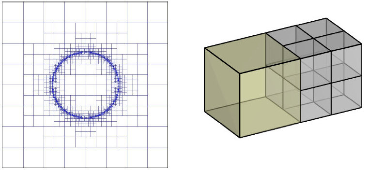

.. _theory:

Background Theory
=================

This section aims to provide the user with a basic review of the physics, discretization, and optimization techniques used to solve the frequency domain quasi-static electromagnetics problem. It
is assumed that the user has some background in these areas. For further reading see :cite:`Nabighian1991`.

.. important::
    The theory provided on this page works for the following right-handed coordinate systems:
        - X = Easting, Y = Northing, Z = Up (standard Cartesian)
        - X = Northing, Y = Easting, Z = Down (standard magnetotelluric which this code uses!)

.. _theory_fundamentals:

Fundamental Physics
-------------------

Maxwell's equations provide the starting point from which an understanding of how electromagnetic
fields can be used to uncover the substructure of the Earth. In the frequency domain Maxwell's
equations are:

.. math::
    \begin{align}
        \nabla \times &\mathbf{E} - i\omega\mu \mathbf{H} = 0 \\
        \nabla \times &\mathbf{H} - \sigma \mathbf{E} = \mathbf{s} 
    \end{align}
    :label:

where :math:`\mathbf{E}` and :math:`\mathbf{H}` are the electric and magnetic fields, :math:`\mathbf{s}` is some external source and :math:`e^{-i\omega t}` is suppressed. Symbols :math:`\mu`, :math:`\sigma` and :math:`\omega` are the magnetic permeability, conductivity, and angular frequency, respectively. This formulation assumes a quasi-static mode so that the system can be viewed as a diffusion equation (Weaver, 1994; Ward and Hohmann, 1988 in :cite:`Nabighian1991`). By doing so, some difficulties arise when
solving the system;

    - the curl operator has a non-trivial null space making the resulting linear system highly ill-conditioned
    - the conductivity :math:`\sigma` varies over several orders of magnitude

.. _theory_nsem:

Natural Sources: MT and ZTEM
----------------------------

The sources in the magnetotelluric (MT) and Z-axis tipper elecromagnetic (ZTEM) methods are modeled as plane waves originating
from natural phenomenon. These waves can be of very low frequency (< 1 Hz) and very high
energy, making it possible to image very deep targets. This also implies that the source term is
zero inside the domain of interest, and therefore the source term on the boundaries becomes very
important. For natural source electromagnetic (NSEM) problems, we solve the following system:

.. math::
    \begin{align}
        \nabla \times &\mathbf{E} - i\omega\mu \mathbf{H} = 0 \\
        \nabla \times &\mathbf{H} - \sigma \mathbf{E} = 0 \\
        &\mathbf{E} \big |_{\partial \Omega} = \mathbf{E_0}
    \end{align}
    :label: NSEM_system

where :math:`\mathbf{E_0}` is the electric field solution on the boundary :math:`\partial \Omega`.

Consider the case where the Earth is a uniform half-space with a plane surface. If the source field is assumed
to be homogeneous, infinite in dimension, and is located at infinity, then the plane waves impinging on the Earth's surface travel in the z-direction.

For plane waves polarized such that their electric fields lie along the x direction, the electric field is defined by the following Helmholtz equation:

.. math::
    \frac{\partial^2 E_x}{\partial z^2} = k^2 E_x \;\;\; \textrm{s.t.} \;\;\; k^2 = -i\mu\omega\sigma
    :label: Helmholtz_E

and the relationship between :math:`E_x` and :math:`H_y` is given by:

.. math::
    i \omega \mu H_y = \frac{\partial E_x}{\partial z}
    :label:

The solution to :eq:`Helmholtz_E` takes the form:

.. math::
    E_x = Q e^{-kz}
    :label:

where :math:`Q` is some constant. Taking the ratio of the electric and magnetic fields measured at the surface
gives:

.. math::
    Z_{xy} = \frac{E_x}{H_y} = \frac{-i\omega \mu}{k} = \sqrt{\dfrac{-i\omega\mu}{\sigma}}
    :label: impedance_hs

This implies that conductivity :math:`\sigma` of the Earth can be determined by taking measurements of the
field components, and therefore the impedance constitutes the basic MT response function, or data.
A 1D layered Earth model can be used to compute the source wave components by iteratively propagating a plane wave from the surface to depth.

Magnetotelluric (MT) Data
^^^^^^^^^^^^^^^^^^^^^^^^^

For a 3-dimensional Earth, the magnetotelluric data are defined by the impedance tensor. The impedance tensor can be defined using the ratios of electric and magnetic field components in both the x and y directions for 2 orthogonal plane wave polarizations; one polarization with the electric field along the x axis and one polarization with the electric file along the y axis. Where the impedance tensor :math:`\mathbf{Z}` is a 2 by 2 matrix:

.. math::
    \mathbf{Z} = \mathbf{E H}^{-1}
    :label:

such that:

.. math::
    \begin{bmatrix} Z_{xx} & Z_{xy} \\ Z_{yx} & Z_{yy} \end{bmatrix} =
    \begin{bmatrix} E_{x}^{(1)} & E_{x}^{(2)} \\ E_{y}^{(1)} & E_{y}^{(2)} \end{bmatrix}
    \begin{bmatrix} H_{x}^{(1)} & H_{x}^{(2)} \\ H_{y}^{(1)} & H_{y}^{(2)} \end{bmatrix}^{-1}
    :label: impedance_tensor

where 1 and 2 refer to fields associated with plane waves polarized along two perpendicular directions.

.. important::
    For standard MT data, X = Northing, Y = Easting and Z = Down; which this code uses! Thus:
        - Superscript :math:`\! ^{(1)}` refers to fields resulting from a plane wave whose electric field is polarized along the Northing direction. And superscript :math:`\! ^{(2)}` refers to fields resulting from a plane wave whose electric field is polarized along the Easting direction.
        - :math:`Z_{xy}` is essentially the ratio of the electric field along the Northing and the magnetic field along the Easting.

ZTEM Data
^^^^^^^^^

The Z-Axis Tipper Electromagnetic Technique (ZTEM) (Lo2008) records
the vertical component of the magnetic field everywhere above the survey area while recording
the horizontal fields at a ground base reference station. In the same manner as demonstrated for
MT, transfer functions are computed which relate the vertical fields to the ground based horizontal
fields. This relation is given by:

.. math::
    H_z(r) = T_{zx}(r,r_0)H_x(r_0) + T_{zy}(r,r_0)H_y(r_0)
    :label:

where :math:`r` is the location of the vertical field and :math:`r_0` is the location of the ground base station. :math:`T_{zx}` and :math:`T_{zy}` are the vertical field transfer functions, from z to x and z to y respectively. For a 3-dimensional Earth, the transfer function can be defined using the magnetic field components for 2 orthogonal plane wave polarizations; one polarization with the electric field along the x axis and one polarization with the electric file along the y axis. In this case,

.. math::
    \begin{bmatrix} H_z^{(1)} \\ H_z^{(2)} \end{bmatrix} =
    \begin{bmatrix} H_x^{(1)} & H_y^{(1)} \\ H_x^{(2)} & H_y^{(2)} \end{bmatrix}
    \begin{bmatrix} T_{zx} \\ T_{zy} \end{bmatrix}
    :label: transfer_fcn

where 1 and 2 refer to fields associated with plane waves polarized along two perpendicular directions. Thus the transfer functions are given by:

.. math::
    \begin{bmatrix} T_{zx} \\ T_{zy} \end{bmatrix} = \big ( H_x^{(1)} H_y^{(2)} - H_x^{(2)} H_y^{(1)} \big )^{-1}
    \begin{bmatrix} - H_y^{(1)} H_z^{(2)} + H_y^{(2)} H_z^{(1)} \\ H_x^{(1)} H_z^{(2)} - H_x^{(2)} H_z^{(1)} \end{bmatrix}
    

.. important::
    For standard natural source data, X = Northing, Y = Easting and Z = Down; which this code uses! Thus:
        - Superscript :math:`\! ^{(1)}` refers to fields resulting from a plane wave whose electric field is polarized along the Northing direction. And superscript :math:`\! ^{(2)}` refers to fields resulting from a plane wave whose electric field is polarized along the Easting direction.
        - :math:`T_{zx}` is the transfer function related to an incident plane wave whose electric field is polarized along the Northing direction; which produces magnetic fields with components in the Easting direction.

Octree Mesh
-----------

By using an Octree discretization of the earth domain, the areas near sources and likely model
location can be give a higher resolution while cells grow large at distance. In this manner, the
necessary refinement can be obtained without added computational expense. Figure(2) shows an
example of an Octree mesh, with nine cells, eight of which are the base mesh minimum size.

When working with Octree meshes, the underlying mesh is defined as a regular 3D orthogonal grid where
the number of cells in each dimension are :math:`2^{m_1} \times 2^{m_2} \times 2^{m_3}`, with grid size :math:`h`. This underlying mesh
is the finest possible, so that larger cells have lengths which increase by powers of 2 multiplied by
:math:`h`. The idea is that if the recovered model properties change slowly over a certain volume, the cells
bounded by this volume can be merged into one without losing the accuracy in modeling, and are
only refined when the model begins to change rapidly.

Discretization of Operators
---------------------------

The operators div, grad, and curl are discretized using a finite volume formulation. Although div and grad do not appear in :eq:`impedance_tensor`, they are required for the solution of the system. The divergence
operator is discretized in the usual flux-balance approach, which by Gauss' theorem considers the current flux through each face of a cell. The nodal gradient (operates on a function with values on the nodes) is obtained by differencing adjacent nodes and dividing by edge length. The discretization of the curl operator is computed similarly to the divergence operator by utilizing Stokes theorem by summing the magnetic field components around the edge of each face. Please
see :cite:`Haber2012` for a detailed description of the discretization process.

Forward Problem
---------------

To solve the forward problem, we must first discretize and solve for the fields in Eq. :eq:`NSEM_system`, where :math:`e^{-i\omega t}` is suppressed. Using finite volume discretization, the electric fields on cell edges (:math:`\mathbf{u_e}`) are obtained by solving the following system at every frequency:

.. math::
    \big [ \mathbf{C^T \, M_\mu \, C} + i\omega \mathbf{M_\sigma} \big ] \, \mathbf{u_e} = - i \omega \mathbf{s}
    :label: discrete_e_sys

where :math:`\mathbf{C}` is the curl operator and:

.. math::
    \begin{align}
    \mathbf{M_\mu} &= diag \big ( \mathbf{A^T_{f2c} V} \, \boldsymbol{\mu^{-1}} \big ) \\
    \mathbf{M_\sigma} &= diag \big ( \mathbf{A^T_{e2c} V} \, \boldsymbol{\sigma} \big ) \\
    \end{align}

where :math:`\mathbf{V}` is a diagonal matrix containing  all cell volumes, :math:`\mathbf{A_{f2c}}` averages from faces to cell centres and :math:`\mathbf{A_{e2c}}` averages from edges to cell centres. The magnetic permeabilities and conductivities for each cell are contained within vectors :math:`\boldsymbol{\mu}` and :math:`\boldsymbol{\sigma}`, respectively.

The right-hand side :math:`\mathbf{s}` has values :math:`\mathbf{E_0}` on the boundary and 0 at inner edges. Values for :math:`\mathbf{E_0}` are obtained by solving a set of 1D problems for a given planewave polarization; either :math:`\mathbf{E_0} = E_x \, \hat{x}` or :math:`\mathbf{E_0} = E_y \, \hat{y}`. For explanation of the 1D solution, see Ward and Hohmann.

Once the electric field on cell edges has been computed, the electric (:math:`\mathbf{E}`) and magnetic (:math:`\mathbf{H}`) fields at observation locations can be obtain via the following:

.. math::
    \begin{align}
    \mathbf{E} &= \mathbf{Q_e \, u_e} = \mathbf{Q_c \, A_{e2c} \, u_e} \\
    \mathbf{H} &= \mathbf{Q_h \, u_e} = \frac{1}{i \omega} \mathbf{Q_c} \, diag(\boldsymbol{\mu}^{-1}) \, \mathbf{A_{f2c} C \, u_e}
    \end{align}
    :label: fields_projected

where :math:`\mathbf{Q_c}` represents the appropriate projection matrix from cell centers to a particular receiver (Ex, Ey, Hx, Hy or Hz).

To obtain impedance tensor (MT) or ZTEM data, we need the electric and/or magnetic fields for two orthogonal source polarizations; generally one in the x direction and one in the y direction. Let :math:`\mathbf{s}^{(1)}` and :math:`\mathbf{s}^{(2)}` denote the right-hand sides for source fields generated for each polarization. And let :math:`\mathbf{u_e}^{(1)}` and :math:`\mathbf{u_e}^{(2)}` denote the corresponding solutions for the electric fields on the edges. Then the electric fields (Ex or Ey) and magnetic fields (Hx, Hy or Hz) at some observation location can be expressed as:

.. math::
    \begin{align}
    E^{(j)} &= \mathbf{Q_e \, u_e}^{(j)} = -i\omega \mathbf{Q_e \, A}(\sigma)^{-1} \, \mathbf{s}^{(j)} \;\;\; \textrm{for} \;\;\; j=1,2 \\
    H^{(j)} &= \mathbf{Q_h \, u_e}^{(j)} = -i\omega \mathbf{Q_h \, A}(\sigma)^{-1} \, \mathbf{s}^{(j)} \;\;\; \textrm{for} \;\;\; j=1,2
    \end{align}
    :label: fields_at_loc

where the matrix

.. math::
    \mathbf{A}(\sigma) = \mathbf{C^T \, M_\mu \, C} + i\omega \mathbf{M_\sigma}
    :label: A_operator

depends on the Earth's conductivity. If the fields at each observation location are known, MT data can be obtained using Eq. :eq:`impedance_tensor` and ZTEM data can be obtained using Eq. :eq:`transfer_fcn`. The only thing that is needed is the source term for Eq. :eq:`discrete_e_sys`.

Source Term
^^^^^^^^^^^

1D Approach
~~~~~~~~~~~

For this approach, we solve a 1D wave equation of the following form:

.. math::
    \mathbf{\tilde{A} \tilde{u}_e} = \mathbf{\tilde{q}}
    :label: wave_eq_1d

where :math:`\mathbf{\tilde{u}_e}` is the electric field for the 1D solution polarized along the x or y directions. :math:`\mathbf{\tilde{A}}` is an operator of the form:

.. math::
    \mathbf{\tilde{A}} = \mathbf{L} + i \omega \mu_0 \tilde{\sigma}

such that :math:`\mathbf{L}` is the Laplacian operator, :math:`\mu_0` is the permeability of free-space and :math:`\tilde{\sigma}` is a 1D conductivity model. The right-hand side :math:`\mathbf{\tilde{q}}` is a vector of zeros except for :math:`\tilde{q}_1`. A Dirichlet condition is imposed by setting :math:`A_{11} = 1` and :math:`\tilde{q}_1 = i\omega \mu_0 h^{-1}`; where :math:`h` is the layer thickness. Once Eq. :eq:`wave_eq_1d` is solved for a particular frequency, the solution is transferred to the edges of an OcTree mesh. If the electric field is polarized along the x direction, there are no electric fields along y or z; similarly for a solution polarized along the y direction. 

Let :math:`\mathbf{u_s}` and :math:`\sigma_s` be the electric fields and 1D conductivity model transferred to the edges of the OcTree mesh, respectively. Then the source term in Eq. :eq:`discrete_e_sys` is computed for a given frequency and polarization using:

.. math::
    \frac{1}{i\omega} \mathbf{A u_s} = \mathbf{s}

where :math:`\mathbf{A}` is similar to expression :eq:`A_operator`, except the mass matrix :math:`\mathbf{M_\sigma}` is formed using the transferred conductivity :math:`\sigma_s`.

3D Approach
~~~~~~~~~~~

Let :math:`\sigma_b` be the 3D background conductivity model. And let :math:`\mathbf{A}` be an operator similar to expression :eq:`A_operator`, except the mass matrix :math:`\mathbf{M_\sigma}` is formed using the background conductivity. If :math:`j=1,...,J` denotes the indicies for all internal edges and :math:`k=1,...,K` denotes the indicies for all top edges, then for each polarization we solve a smaller system:

.. math::
    \mathbf{A_{j,j} u_j} = - \mathbf{A_{j,k} b}

where :math:`\mathbf{b}` is a vector of ones with length :math:`K` and :math:`\mathbf{u_j}` is the background electric field on internal edges. From this we form a vector :math:`\mathbf{u_b}` where:

    - :math:`\mathbf{u_b} = 1` on the top edges
    - :math:`\mathbf{u_b} = \mathbf{u_j}` on internal edges
    - :math:`\mathbf{u_b} = 0` otherwise

Once this is done, the source term in Eq. :eq:`discrete_e_sys` is computed for a given frequency and polarization using:

.. math::
    \frac{1}{i\omega} \mathbf{A u_s} = \mathbf{s}

.. _theory_sensitivity:

Sensitivity
-----------

MT Data
^^^^^^^

Impedance tensor data are split into their real and imaginary components. Thus the data at a particular frequency for a particular reading is organized in a vector of the form:

.. math::
    \mathbf{Z} = [Z^\prime_{xx}, Z^{\prime \prime}_{xx}, Z^\prime_{xy}, Z^{\prime \prime}_{xy}, Z^\prime_{yx}, Z^{\prime \prime}_{yx}, Z^\prime_{yy}, Z^{\prime \prime}_{yy}]^T
    :label: Z_vector

where :math:`\prime` denotes real components and :math:`\prime\prime` denotes imaginary components. To determine the sensitivity of the data (i.e. :eq:`Z_vector`) with respect to the model (:math:`\boldsymbol{\sigma}`), we must compute:

.. math::
    \frac{\partial \mathbf{Z}}{\partial \boldsymbol{\sigma}} = \Bigg [ \dfrac{\partial Z_{xx}^\prime}{\partial \boldsymbol{\sigma}} ,
    \dfrac{\partial Z_{xx}^{\prime\prime}}{\partial \boldsymbol{\sigma}} ,
    \dfrac{\partial Z_{xy}^\prime}{\partial \boldsymbol{\sigma}} ,
    \dfrac{\partial Z_{xy}^{\prime\prime}}{\partial \boldsymbol{\sigma}} ,
    \dfrac{\partial Z_{yx}^\prime}{\partial \boldsymbol{\sigma}} ,
    \dfrac{\partial Z_{yx}^{\prime\prime}}{\partial \boldsymbol{\sigma}} ,
    \dfrac{\partial Z_{yy}^\prime}{\partial \boldsymbol{\sigma}} ,
    \dfrac{\partial Z_{yy}^{\prime\prime}}{\partial \boldsymbol{\sigma}} \Bigg ]^T

where the conductivity model :math:`\boldsymbol{\sigma}` is real-valued and

.. math::
    Z_{xx}^\prime = \textrm{Re} \Bigg [\frac{E_{xx} H_{yy} - E_{xy} H_{yx}}{H_{xx}H_{yy} - H_{xy}H_{yx}} \Bigg ]
    :label: Zxx_prime

which can be expanded and expressed explicitly in terms of the real and imaginary components of :math:`E_{ij}` and :math:`H_{ij}`. Similar expressions result for the other elements of :eq:`Z_vector`.

To differentiate :eq:`Zxx_prime` (or any other element and component of the impedance tensor) with respect to the model, we replace :math:`E_{ij}` and :math:`H_{ij}` according to Eq. :eq:`fields_at_loc` and use the chain rule. The final expression contains the derivative of the electric fields on the edges (:math:`\mathbf{u_e}`) with respect to the model. This is given by:

.. math::
    \frac{\partial \mathbf{u_e}}{\partial \boldsymbol{\sigma}} = - i\omega \mathbf{A}^{-1} diag(\mathbf{u_e}) \, \mathbf{A_{e2c}^T V }
    :label: sensitivity_fields

ZTEM Data
^^^^^^^^^

ZTEM data are also split into their real and imaginary components. Thus the data at a particular frequency for a particular reading is organized in a vector of the form:

.. math::
    \mathbf{T} = [T^\prime_{zx}, T^{\prime \prime}_{zx}, T^\prime_{zy}, T^{\prime \prime}_{zy}]^T
    :label: T_vector

where :math:`\prime` denotes real components and :math:`\prime\prime` denotes imaginary components. To determine the sensitivity of the data (i.e. :eq:`T_vector`) with respect to the model (:math:`\boldsymbol{\sigma}`), we must compute:

.. math::
    \frac{\partial \mathbf{T}}{\partial \boldsymbol{\sigma}} = \Bigg [ \dfrac{\partial T_{zx}^\prime}{\partial \boldsymbol{\sigma}} ,
    \dfrac{\partial T_{zx}^{\prime\prime}}{\partial \boldsymbol{\sigma}} ,
    \dfrac{\partial T_{zy}^\prime}{\partial \boldsymbol{\sigma}} ,
    \dfrac{\partial T_{zy}^{\prime\prime}}{\partial \boldsymbol{\sigma}} \Bigg ]^T

where the conductivity model :math:`\boldsymbol{\sigma}` is real-valued and

.. math::
    T_{zx}^\prime = \textrm{Re} \Bigg [ \frac{-H_y^{(1)} H_z^{(2)} + H_y^{(2)} H_z^{(1)}}{ H_x^{(1)} H_y^{(2)} - H_x^{(2)} H_y^{(1)}} \Bigg ]
    :label: Tzx_prime

which can be expanded and expressed explicitly in terms of the real and imaginary components of :math:`H_j^{(i)}`. Similar expressions result for the other elements of :eq:`T_vector`.

To differentiate :eq:`Tzx_prime` (or any other element and component) with respect to the model, we replace :math:`H_j^{(i)}` according to Eq. :eq:`fields_at_loc` and use the chain rule. The final expression contains the derivative of the electric fields on the edges (:math:`\mathbf{u_e}`) with respect to the model with is given by Eq. :eq:`sensitivity_fields`.

.. _theory_inv:

Inverse Problem
---------------

To solve the inverse problem, we minimize the following global objective function:

.. math::
    \phi = \phi_d + \beta \phi_m
    :label: global_objective

where :math:`\phi_d` is the data misfit and :math:`\phi_m` is the model objective function. The data misfit ensures the recovered model adequately explains the set of field observations. The model objective function adds geological constraints to the recovered model.

Data Misfit
^^^^^^^^^^^

Here, the data misfit is represented as the L2-norm of a weighted residual between the observed data (:math:`d_{obs}`) and the predicted data for a given conductivity model :math:`\boldsymbol{\sigma}`, i.e.:

.. math::
    \phi_d = \big \| \mathbf{W_d} \big ( \mathbf{d_{obs}} - \mathbb{F}[\boldsymbol{\sigma}] \big ) \big \|^2
    :label: data_misfit_2

where :math:`W_d` is a diagonal matrix containing the reciprocals of the uncertainties :math:`\boldsymbol{\varepsilon}` for each measured data point, i.e.:

.. math::
    \mathbf{W_d} = \textrm{diag} \big [ \boldsymbol{\varepsilon}^{-1} \big ] 

.. important:: For a better understanding of the data misfit, see the `GIFtools cookbook <http://giftoolscookbook.readthedocs.io/en/latest/content/fundamentals/Uncertainties.html>`__ .

Model Objective Function
^^^^^^^^^^^^^^^^^^^^^^^^

Due to the ill-posedness of the problem, there are no stable solutions obtain by freely minimizing the data misfit, and thus regularization is needed. The regularization used penalties for both smoothness, and likeness to a reference model :math:`\mathbf{m_{ref}}` supplied by the user.

.. math::
    \phi_m (\mathbf{m-m_{ref}}) = \frac{1}{2} \big \| \nabla (\mathbf{m - m_{ref}}) \big \|^2_2
    :label:

An important consideration comes when discretizing the regularization. The gradient operates on
cell centered variables in this instance. Applying a short distance approximation is second order
accurate on a domain with uniform cells, but only :math:`\mathcal{O}(1)` on areas where cells are non-uniform. To
rectify this a higher order approximation is used (:cite:`Haber2012`). The discrete regularization
operator can then be expressed as

.. math::
    \begin{align}
    \phi_m(\mathbf{m}) &= \frac{1}{2} \int_\Omega \big | \nabla m \big |^2 dV \\
    & \approx \frac{1}{2}  \beta \mathbf{ m^T G_c^T} \textrm{diag} (\mathbf{A_f^T v}) \mathbf{G_c m}
    \end{align}
    :label:

where :math:`\mathbf{A_f}` is an averaging matrix from faces to cell centres, :math:`\mathbf{G}` is the cell centre to cell face gradient operator, and v is the cell volume For the benefit of the user, let :math:`\mathbf{W^T W}` be the weighting matrix given by:

.. math::
    \mathbf{W^T W} = \beta \mathbf{ G_c^T} \textrm{diag}(\mathbf{A_f^T v}) \mathbf{G_c m} =
    \begin{bmatrix} \mathbf{\alpha_x} & & \\ & \mathbf{\alpha_y} & \\ & & \mathbf{\alpha_z} \end{bmatrix} \big ( \mathbf{G_x^T \; G_y^T \; G_z^T} \big ) \textrm{diag} (\mathbf{v_f}) \begin{bmatrix} \mathbf{G_x} \\ \mathbf{G_y} \\ \mathbf{G_z} \end{bmatrix}
    :label:

where :math:`\alpha_i` for :math:`i=x,y,z` are diagonal matricies. In the code the :math:`\mathbf{W^T W}` matrix is stored as a separate matrix so that individual model norm components can be calculated. Now, if a cell weighting is used it is applied to the entire norm, that is, there is a w for each cell.

.. math::
    \mathbf{W^T W} = \textrm{diag} (w) \mathbf{W^T W} \textrm{diag} (w)
    :label:

There is also the option of choosing a cell interface weighting. This allows for a weight on each cell FACE. The user must supply the weights (:math:`w_x, w_y, w_z` ) for each weighted cell. When the interface
weighting option is chosen and the value is less than 1, a sharp discontinuity will be created. When
the value is greater than 1, there will be a smooth transition. To prevent the inversion from putting
"junk" on the surface, the top X and Y face weights should have a large value.

.. math::
    \mathbf{W^T W} = \mathbf{\alpha_x G_x^T} \textrm{diag} (w_x v_f) \mathbf{G_x} + \mathbf{\alpha_y G_y^T} \textrm{diag} (w_y v_f) \mathbf{G_y} + \mathbf{\alpha_z G_z^T} \textrm{diag} (w_z v_f) \mathbf{G_z}
    :label: MOF

The resulting optimization problem is therefore:

.. math::
    \begin{align}
    &\min_m \;\; \phi_d (\mathbf{m}) + \beta \phi_m(\mathbf{m - m_{ref}}) \\
    &\; \textrm{s.t.} \;\; \mathbf{m_L \leq m \leq m_H}
    \end{align}
    :label: inverse_problem

where :math:`\beta` is a regularization parameter, and :math:`\mathbf{m_L}` and :math:`\mathbf{m_H}` are upper and lower bounds provided by some a prior geological information.
A simple Gauss-Newton optimization method is used where the system of equations is solved using ipcg (incomplete preconditioned conjugate gradients) to solve for each G-N step. For more
information refer again to :cite:`Haber2012` and references therein.

Inversion Parameters and Tolerances
^^^^^^^^^^^^^^^^^^^^^^^^^^^^^^^^^^^

.. _theory_cooling:

Cooling Schedule
~~~~~~~~~~~~~~~~

Our goal is to solve Eq. :eq:`inverse_problem`, i.e.:

.. math::
    \begin{align}
    &\min_m \;\; \phi_d (\mathbf{m}) + \beta \phi_m(\mathbf{m - m_{ref}}) \\
    &\; \textrm{s.t.} \;\; \mathbf{m_L \leq m \leq m_H}
    \end{align}

but how do we choose an acceptable trade-off parameter :math:`\beta`? For this, we use a cooling schedule. This is described in the `GIFtools cookbook <http://giftoolscookbook.readthedocs.io/en/latest/content/fundamentals/Beta.html>`__ . The cooling schedule can be defined using the following parameters:

    - **beta_max:** The initial value for :math:`\beta`
    - **beta_factor:** The factor at which :math:`\beta` is decrease to a subsequent solution of Eq. :eq:`inverse_problem`
    - **beta_min:** The minimum :math:`\beta` for which Eq. :eq:`inverse_problem` is solved before the inversion will quit (E3DMT version 1 only)
    - **nBetas:** The number of times the inversion code will decrease :math:`\beta` and solve Eq. :eq:`inverse_problem` before it quits (E3DMT version 2 only)
    - **Chi Factor:** The inversion program stops when the data misfit :math:`\phi_d = N \times Chi \; Factor`, where :math:`N` is the number of data observations

.. _theory_GN:

Gauss-Newton Update
~~~~~~~~~~~~~~~~~~~

For a given trade-off parameter (:math:`\beta`), the model :math:`\mathbf{m}` is updated using the Gauss-Newton approach. Because the problem is non-linear, several model updates may need to be completed for each :math:`\beta`. Where :math:`k` denotes the Gauss-Newton iteration, we solve:

.. math::
    \mathbf{H}_k \, \mathbf{\delta m}_k = - \nabla \phi_k
    :label: GN_gen

using the current model :math:`\mathbf{m}_k` and update the model according to:

.. math::
    \mathbf{m}_{k+1} = \mathbf{m}_{k} + \alpha \mathbf{\delta m}_k
    :label: GN_update

where :math:`\mathbf{\delta m}_k` is the step direction, :math:`\nabla \phi_k` is the gradient of the global objective function, :math:`\mathbf{H}_k` is an approximation of the Hessian and :math:`\alpha` is a scaling constant. This process is repeated until any of the following occurs:

    1. The gradient is sufficiently small, i.e.:

        .. math::
            \| \nabla \phi_k \|^2 < \textrm{tol_nl}

    2. The smallest component of the model perturbation its small in absolute value, i.e.:

        .. math::
            \textrm{max} ( |\mathbf{\delta m}_k | ) < mindm

    3. A max number of GN iterations have been performed, i.e.

        .. math::
            k = \textrm{iter_per_beta} 

.. _theory_IPCG:

Gauss-Newton Solve
~~~~~~~~~~~~~~~~~~

Here we discuss the details of solving Eq. :eq:`GN_gen` for a particular Gauss-Newton iteration :math:`k`. Using the data misfit from Eq. :eq:`data_misfit_2` and the model objective function from Eq. :eq:`MOF`, we must solve:

.. math::
    \Big [ \mathbf{J^T W_d^T W_d J + \beta \mathbf{W^T W}} \Big ] \mathbf{\delta m}_k =
    - \Big [ \mathbf{J^T W_d^T W_d } \big ( \mathbf{d_{obs}} - \mathbb{F}[\mathbf{m}_k] \big ) + \beta \mathbf{W^T W m}_k \Big ]
    :label: GN_expanded

where :math:`\mathbf{J}` is the sensitivity of the data (:math:`\mathbf{Z}` or :math:`\mathbf{T}`) to the current model :math:`\mathbf{m}_k`; see :ref:`sensitivity section <theory_sensitivity>` to learn how sensitivities are computed. The system is solved for :math:`\mathbf{\delta m}_k` using the incomplete-preconditioned-conjugate gradient (IPCG) method. This method is iterative and exits with an approximation for :math:`\mathbf{\delta m}_k`. Let :math:`i` denote an IPCG iteration and let :math:`\mathbf{\delta m}_k^{(i)}` be the solution to :eq:`GN_expanded` at the :math:`i^{th}` IPCG iteration, then the algorithm quits when:

    1. the system is solved to within some tolerance and additional iterations do not result in significant increases in solution accuracy, i.e.:

        .. math::
            \| \mathbf{\delta m}_k^{(i-1)} - \mathbf{\delta m}_k^{(i)} \|^2 / \| \mathbf{\delta m}_k^{(i-1)} \|^2 < \textrm{tol_ipcg}

    2. a maximum allowable number of IPCG iterations has been completed, i.e.:

        .. math::
            i = \textrm{max_iter_ipcg}

