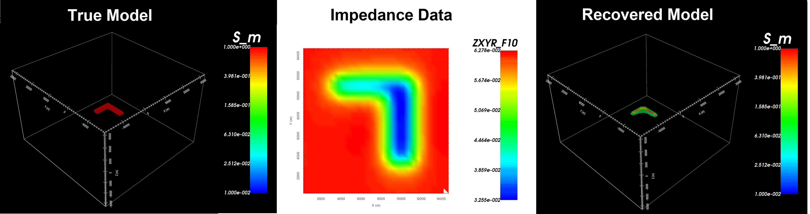

ED3MT (Version 1) package
=========================

E3DMT version 1 package is a program library for carrying out forward modelling and inversion of magnetotelluric and Z-axis tipper EM data 3D. 

    True model, magnetotelluric data and the recovered model.

Highlights
^^^^^^^^^^

Many advancements have been made since the creation of the original tensor code (`MTZ3D <mtz3d.readthedocs.io>`_ ). Hightlights include:

  - the ability to model both magnetotelluric impedance data and Z-axis tipper data on an OcTree mesh
  - joint inversion of magnetotelluric and Z-axis tipper data
  - the ability to solve linear systems with iterative or direct solvers

Contents
^^^^^^^^

The contents of this manual are as follows:

.. toctree::
    :numbered:
    :maxdepth: 1

    Package overview <content/overview>
    Background theory <content/theory>
    Elements <content/elements>    
    Running the programs <content/runPrograms>
    Examples <content/examples>    
    References <references>
    

